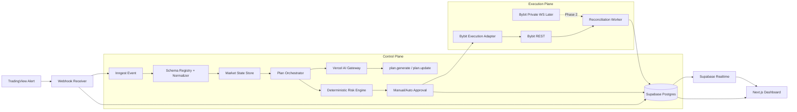
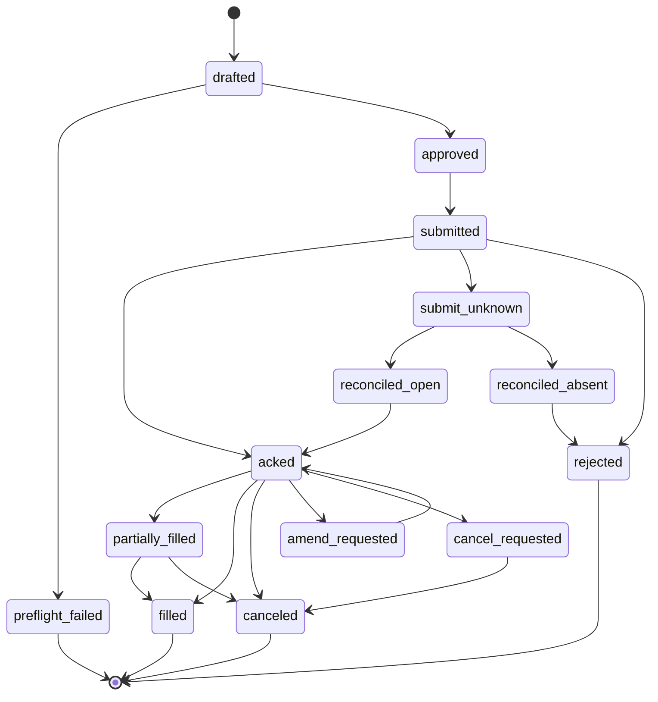

# Vercel Gateway 与 Bybit 驱动的交易 MVP 工程化设计报告

> 本文描述工程落地方式；最终实现契约以 `../freeze/mvp-phase-0-freeze.md` 为准。

## Executive summary

在你已经确定采用 **urlVercelturn2search5 + urlSupabaseturn21search1 + urlInngestturn4search1** 的前提下，我认为这套系统最合适的工程形态不是“多微服务”，而是一个**模块化单体**：前端、Webhook 接收、业务 API、Inngest durable workflows、数据库模型和交易所适配层放在同一代码仓内，用清晰的目录边界和事件契约替代网络微服务边界。这样能保持 solo founder 级别的开发速度，同时保留未来把“执行层”单独抽出来的空间。([vercel.com](https://vercel.com/docs))

在模型层，把原来直接绑某一家 LLM API 的做法换成 **urlVercel AI Gatewayturn16search1** 是合理升级。官方文档明确说明，AI Gateway 提供统一端点、预算控制、使用监控、负载均衡和 fallback 管理；同时它既支持 OpenAI-compatible 的 Responses API，也支持 OpenResponses 规范，并支持 BYOK 模式，使用自带 provider key 时没有额外 markup 或 gateway fee。对你的场景来说，这意味着**模型不是架构依赖，而是配置项**：MVP 只保留 `plan.generate` 与 `plan.update` 两类调用，上层业务代码与审计结构保持不变。([vercel.com](https://vercel.com/docs/ai-gateway))

执行层方面，我建议你把 **urlBybit 官方 API 文档turn1search10** 当作唯一真相源，把“SDK”视为 transport driver，而不是业务模型。Bybit 官方文档列出了官方 Python/Go/Java/.NET SDK 和社区 Node.js SDK；与此同时，官方 `pybit` 仓库明确把自己定义为“官方、轻量、一站式 HTTP + WebSocket connector”，并由 Bybit 员工维护。工程上最稳妥的做法，是在系统内部定义一层 `VenueExecutionPort` 抽象，让上层永远只看到“下单、改单、撤单、查单、同步仓位”这些动作，而不直接耦合某个 SDK。([bybit-exchange.github.io](https://bybit-exchange.github.io/docs/v5/guide))

这份报告的核心结论是：**TradingView 负责发“候选与上下文”，Gateway 负责多模型路由，LLM 负责生成结构化计划，deterministic risk engine 负责审批，Bybit adapter 负责执行，数据库负责成为审计真相源。** 而从工程实践上看，最关键的四件事分别是：把 TradingView 当成 at-least-once webhook 源；把 Payload 版本严格契约化；把执行层做成显式状态机；把所有副作用写入可回放的账本。([tradingview.com](https://www.tradingview.com/support/solutions/43000529348-how-to-configure-webhook-alerts/?utm_source=chatgpt.com))

## Payload 契约与系统前提

先说一个非常重要、但很容易被忽略的事实：**TradingView 并不定义一个通用“交易业务 payload schema”**。官方文档定义的是 webhook 传输行为：它会在 alert 触发时向你提供的 URL 发一个 HTTP POST，请求体就是 alert 的 message；如果 message 是合法 JSON，`Content-Type` 会是 `application/json`，否则是 `text/plain`。因此，你真正应该围绕它建后端契约的，不是一个“TradingView 官方交易 payload”，而是你自己的业务 schema。([tradingview.com](https://www.tradingview.com/support/solutions/43000529348-how-to-configure-webhook-alerts/?utm_source=chatgpt.com))

而你现在已经有了一个非常清晰的业务 schema：`bitpunk.webhook.v12`。它把所有 confirmed bar 数据拆成两类：`snapshot` 和 `signal`。`snapshot` 只更新市场状态，不应直接创建交易；`signal` 才是经过指标内部 filter 之后的“候选交易”。这和 TradingView 官方“message body as-is”模型是兼容的，而且比很多直接发 `BUY/SELL` 字符串的做法工程上稳健得多。fileciteturn1file0

你的后端应当把 v12 契约视为一个**强版本协议**，而不是“尽量兼容”的 JSON。因为你自己在 payload 规范里已经写明，遇到未知 `schema_version` 时 agent 应该拒收或隔离处理；并且顶层 `type`、`context.market`、`context.bar.time_ms`、`signal.direction`、`rank_level`、`gain`、`pain`、`proposed_size` 等字段都被明确赋予了决策语义。特别是 `tickerid + timeframe + context.bar.time_ms + type` 这条去重思路，本身就很适合直接映射成数据库唯一键。fileciteturn1file0

从官方 webhook 行为看，接收端必须遵守几条硬约束。TradingView 只接受 80 和 443 端口；远端服务器处理超过 3 秒就会取消该请求；IPv6 目前不支持；如果接收应用返回 500–599（不含 504），会每隔 5 秒重发一次，总共最多 3 次重发，也就是一次 trigger 最多 4 次 webhook 发送。换句话说，这个入口天然就是**at-least-once delivery**，而不是 exactly-once。([tradingview.com](https://www.tradingview.com/support/solutions/43000735201-webhook-resubmission/))

再加上 TradingView 官方还特别提醒：alerts **不是为 automated trading 设计的**，不要在 webhook URL 或 message 中放登录凭证、密码等敏感数据，并始终使用安全、带认证的 endpoint。它还提供了 SSL certificate 校验信息和官方发包 IP 列表，用于 allowlist 与真实性校验。这些要求共同决定了你的接收层设计：**必须快 ACK、强校验、可重放、可幂等、不可把任何真实凭证交给 TradingView。** ([tradingview.com](https://www.tradingview.com/support/solutions/43000722015-using-credentials-for-webhooks/))

基于这些事实，我建议你在系统内部引入一个“规范化信封”对象，把 TradingView 外部输入变成内部标准事件：

```ts
type CanonicalEnvelope = {
  source: "tradingview";
  sourceSchemaVersion: "bitpunk.webhook.v12";
  internalSchemaVersion: "core.alert.v1";
  type: "snapshot" | "signal";
  marketKey: string;      // tickerid:timeframe
  eventKey: string;       // tickerid:timeframe:bar.time_ms:type
  barTimeMs: number;
  receivedAt: string;
  context: {...};
  signal?: {...};
  raw: unknown;
};
```

这个对象的作用不是重复造 schema，而是把外部协议和内部业务剥离。以后 Pine 再从 v12 变化到 v13，你只需要改 adapter，不需要改后面的 plan/risk/execution 主链。

## 总体架构设计

我建议把整个系统明确拆成两条平面：**控制平面** 和 **执行平面**。控制平面负责“接收、归档、生成计划、审批、展示”；执行平面负责“把审批通过的动作翻译成交易所操作，并持续对账恢复”。这样做的好处是，LLM、风控和 UI 都不会和交易所 SDK 紧耦合。这个边界一旦立住，后面无论从 Bybit 切到其他交易所，还是从某个 Node client 切到 `pybit`，上游都不用大改。([vercel.com](https://vercel.com/docs/ai-gateway))



在这个架构下，**urlVercel Functionsturn19search17** 适合做轻量 API 和 I/O-bound orchestration，而 **urlInngest durable executionturn4search1** 负责重试、等待、异步推进和审批流。Vercel 官方文档把 Functions 描述为“自动按需求扩展、适合 AI workloads 和 I/O-bound tasks”，而 Fluid Compute 则能在请求集中到同一个函数时提升并发效率；Inngest 官方则明确把 queueing、scaling、concurrency、throttling、rate limiting 和 observability 作为平台能力暴露出来。对一个 webhook → workflow → API 这种路径来说，这种职责分工非常自然。([vercel.com](https://vercel.com/docs/functions))

如果按成本和功能看，这套方案也很顺。Vercel Pro 当前是 20 美元/月，Supabase Pro 当前是 25 美元/月，Inngest 免费层包含 50,000 executions/月；而 AI Gateway 在所有计划可用，且如果你通过 BYOK 使用自带 provider keys，官方文档明确写了“没有 markup 或 gateway fee”。这意味着你可以在相对可控的固定成本下，把模型路由、监控和 fallback 都标准化掉。([vercel.com](https://vercel.com/pricing?utm_source=chatgpt.com))

AI Gateway 在这套架构中不是“聊天层插件”，而是**模型控制面板**。推荐做法是：

- 把所有 LLM 调用都走 Gateway。
- 不在业务代码里写死 provider/model。
- 使用 Gateway 的 provider routing、fallback 和 budgets 能力定义两类 MVP policy：
  - `plan.generate`
  - `plan.update`
- worker 中优先使用 OpenAI-compatible Responses API 接口，因为 Gateway 官方直接支持把 OpenAI SDK 的 `baseURL` 指向 `https://ai-gateway.vercel.sh/v1`。([vercel.com](https://vercel.com/docs/ai-gateway/sdks-and-apis/responses))

这会带来两个非常实际的收益。第一，模型切换变成配置，而不是重构。第二，LLM 成本、provider 切换、故障 fallback 和 usage audit 能在一层看见。Gateway 官方 Observability 页面也明确说明它会记录 spend、model usage 和请求明细；这非常适合你后面在前端加一页 “模型使用与成本审计”。([vercel.com](https://vercel.com/docs/ai-gateway/capabilities/observability))

这里还要点出一个常被忽视的运营问题：**出站 IP**。如果你未来要对交易所 API key 做 IP allowlisting，那么默认 serverless 出站并不总是固定。Vercel 在 2026 年已经提供 Static IPs，Pro/Enterprise 可用，但 Pro 上是额外收费能力；价格页写的是 100 美元/项目/月。与此同时，Supabase 官方 troubleshooting 文档明确说明 Edge Functions 不能提供静态 egress IP，用于 IP allowlisting 并不合适。对你的系统意味着：**MVP 阶段别为了 IP 白名单复杂化；一旦进 live 并需要白名单，就把执行路径放到带 Static IP 的 Vercel 项目，或者单独抽一条固定出口链路。** ([vercel.com](https://vercel.com/docs/connectivity/static-ips))

## 功能设计与模块设计

这套系统最适合的代码组织方式，是一个**单仓模块化单体**。业务边界靠 package 和 contract，而不是一上来靠微服务。建议结构如下：

```text
/apps
  /web
    /app
    /api
      /webhooks/tradingview
      /plans/[id]/approve
      /plans/[id]/reject
      /kill-switch
      /internal/bybit/execute
    /inngest
/packages
  /contracts
    tradingview-v12.ts
    core-events.ts
    plan-schema.ts
    risk-schema.ts
  /db
    prisma/
    queries/
    mappers/
  /core
    normalize/
    state-store/
    planner/
    risk-engine/
    approvals/
  /llm
    gateway-client/
    prompt-templates/
    model-policies/
    result-validators/
  /venues
    /bybit
      instrument-cache/
      order-builder/
      http-driver/
      ws-driver-later/
      reconciler/
  /telemetry
    logger/
    trace/
    metrics/
  /security
    envelope-encryption/
    webhook-auth/
    audit/
```

### 模块职责矩阵

| 模块 | 输入 | 输出 | 关键职责 |
|---|---|---|---|
| Webhook Receiver | TradingView POST | `webhook_events` + Inngest event | 校验、去重、快 ACK |
| Schema Registry | raw payload | `CanonicalEnvelope` | 版本识别、字段标准化 |
| Market State Store | `snapshot` / `signal` | 最新闭盘状态、历史快照 | 维护 symbol/timeframe 状态 |
| Plan Orchestrator | signal + state + account context | `trade_plan_versions` | 组装 LLM 输入、调用 Gateway、保存计划 |
| Risk Engine | `trade_plan_version` + limits + account | `risk_verdicts` | 硬风控审批 |
| Approval Service | risk verdict + user action | execution request | 人工批准 / autopilot 门控 |
| Bybit Execution Adapter | execution request | orders / fills / positions | 交易所参数翻译与下单 |
| Reconciliation Worker | exchange state | state repair | 查单、查仓、补账、恢复 |
| Dashboard API | DB state | UI views | 列表、详情、操作 |
| Audit & Telemetry | all events | audit logs / traces | 审计、 debug、SLO |

### 核心功能流设计

#### Webhook 接收流

Webhook receiver 必须是系统里延迟最低、逻辑最少的部分。推荐顺序：

1. 验证 `Content-Type` 与 body 是否可解析。
2. 校验共享 secret。
3. 可选校验 TradingView SSL certificate 与来源 IP。
4. 识别 `schema_version`。
5. 把原始 payload 写入 `webhook_events`。
6. 生成 `event_key`。
7. 发送 `tv.payload.received` 到 Inngest。
8. 立即返回 `200`。  

这条流不做 LLM、不做风控、不做订单动作，因为 TradingView 官方 3 秒超时与 5xx 重发机制造成的设计压力非常明确。([tradingview.com](https://www.tradingview.com/support/solutions/43000735201-webhook-resubmission/))

#### Snapshot 流

`type == "snapshot"` 时，严格遵守你自己的 payload 规范：只更新市场状态，不创建新交易。更准确地说，它应该做两件事：

- 更新 `market_state_current`
- 若存在 `active_plan` 或 `open_position`，触发一次 `plan.update.requested`  

这样，snapshot 不会错误地产生新开仓，但可以驱动保护性动作，例如：移动止损、取消失效挂单、将计划转为 `watch`。这和你的 payload 文档里 “snapshot 只刷新市场状态缓存，不要因为收到 snapshot 就创建新交易” 完全一致。fileciteturn1file0

#### Signal 流

`type == "signal"` 时，进入真正的交易候选路径。这个阶段不要让 LLM 直接看到所有 raw JSON，而应当经过一个 planner input assembler 把输入裁剪成：

- 当前 `signal` 核心字段
- 最近相关 timeframe 状态
- 当前账户与持仓状态
- 当前策略规则
- 当前模型 policy
- 当前交易所能力快照

一个很实用的内部输入对象可以长这样：

```ts
type PlannerInput = {
  signal: {
    direction: "long" | "short";
    rankLevel: number;
    rankPct: number;
    gain: number;
    pain: number;
    proposedSize: number;
    regime: string;
    regimeAlignment: "align" | "counter" | "neutral";
    kl: { hasKl: boolean; role: string; source: string };
    divergence: { hasDivergence: boolean };
  };
  context: {
    market: {...};
    bar: {...};
    volatility: {...};
    regime: {...};
    structure: {...};
    momentum: {...};
    osc: {...};
  };
  state: {
    latestSnapshots: {...};
    activePlan?: {...};
    openOrders: [...];
    openPosition?: {...};
  };
  account: {
    equity: number;
    availableBalance: number;
    riskLimits: {...};
  };
};
```

你当前的 v12 payload 已经非常接近这个形状，所以 adapter 层只需要做字段标准化和版本兼容，而不必重新“推导指标”。fileciteturn1file0

Planner 的输出只保留一套契约：`action + market_thesis + execution_playbook + risk_intent`。它负责表达交易判断与计划状态，不负责直接给出最终下单数量；数量、杠杆与是否允许执行都交给 deterministic risk engine。这样可以避免同时维护“agent 决策对象”和“执行对象”两套重叠 schema。

### Inngest 事件设计

**urlInngestturn4search1** 最适合把你的业务流做成显式领域事件。推荐事件名如下：

| 事件名 | 生产者 | 消费者 |
|---|---|---|
| `tv.payload.received` | Webhook Receiver | Normalizer |
| `market.state.updated` | Normalizer | State Store / Planner |
| `plan.requested` | Signal Workflow | Plan Orchestrator |
| `plan.generated` | Plan Orchestrator | Risk Engine |
| `risk.evaluated` | Risk Engine | Approval Service / Executor |
| `execution.requested` | Approval Service | Bybit Adapter |
| `execution.reconcile.requested` | Adapter / cron | Reconciler |
| `execution.terminal` | Reconciler | State Updater / Dashboard |

这套事件化设计和 Inngest 的使用方式非常契合，因为它本身就是 event-driven durable execution 平台，支持事件触发、多步工作流、等待事件恢复、并发控制和节流。([inngest.com](https://www.inngest.com/docs/events))

最关键的是，你可以用 `step.waitForEvent()` 很自然地实现“计划已生成，等待人工批准 15 分钟，否则过期”的逻辑；这比自己写数据库轮询或 cron watcher 干净得多。([inngest.com](https://www.inngest.com/docs/features/inngest-functions/steps-workflows/wait-for-event))

### AI Gateway 适配设计

Gateway 层不要直接耦合到某一个 prompt 文件，而要抽象成**模型政策**：

| Policy | 用途 | 推荐行为 |
|---|---|---|
| `plan.generate` | 新 signal 生成交易计划 | 强模型、严格 JSON schema、低温度、有 fallback |
| `plan.update` | snapshot/持仓跟随更新 | 更快更便宜模型、严格 JSON schema |

Gateway 官方文档说明它支持 provider routing 和 model fallbacks，因此你可以把 provider 选择放在 Gateway 层，而不是代码层。dashboard 摘要优先从结构化计划直接渲染，先不要为了 UI 再引入一次模型调用。([vercel.com](https://vercel.com/docs/ai-gateway/models-and-providers))

如果后端主要写 TypeScript，我建议 worker 层优先用 **OpenAI SDK + AI Gateway baseURL**，原因很简单：Responses API 的抽象更贴近你的结构化计划用例，而 Gateway 官方就直接支持这种用法。前端若以后需要流式“reasoning summary”展示，再补 AI SDK 就好。([vercel.com](https://vercel.com/docs/ai-gateway/sdks-and-apis/responses))

## Bybit 执行层工程设计

### 建议的实现策略

如果只从“最少工程复杂度”看，我建议 **MVP 的执行层先只做 Bybit HTTP 提交 + REST 对账，不把私有 WebSocket 监听做成第一天必选项**。这是因为 TradingView 信号本身并不是高频秒级策略，而 Bybit 的官方文档已经给出足够完善的同步与查询接口；在系统稳定之前，先用 HTTP 提交、再用定时 reconcile 拉回订单/成交/仓位，能显著降低常驻连接、断线恢复和状态漂移的复杂度。([bybit-exchange.github.io](https://bybit-exchange.github.io/docs/v5/order/create-order))

把 WebSocket 私有流放到 Phase 2 的理由也很充分。Bybit 的私有 `order`、`execution`、`position`、`wallet` 主题都很有价值，但它们本身也带来细节复杂性：`order` 流可能在“已成交但同时收到取消请求”时推送两个 `Filled` 状态；`position` 流在 create/amend/cancel 订单时即使仓位没变也会发新消息；`wallet` 流订阅成功时没有 snapshot，而且 unrealized PnL 变化不会触发 event。换句话说，**即使用了私有流，你最终仍然需要周期性 reconcile**。([bybit-exchange.github.io](https://bybit-exchange.github.io/docs/v5/websocket/private/order))

因此，推荐的分阶段策略是：

- **Phase A**：HTTP submit + REST reconcile。
- **Phase B**：增加 private WS 监听以降低状态收敛延迟。
- **Phase C**：在 live autopilot 时启用 DCP 和更严格的断连保护。([bybit-exchange.github.io](https://bybit-exchange.github.io/docs/v5/websocket/private/dcp))

### SDK 选型建议

Bybit 官方“Integration Guidance”明确列出：官方 Python SDK、官方 Go SDK、官方 Java SDK、官方 .NET SDK，以及社区 Node.js SDK。与此同时，`pybit` 官方 GitHub 仓库把自己定位为“official lightweight one-stop-shop module for HTTP and WebSocket APIs”，并说明由 Bybit 员工维护。对你的 TypeScript 主栈，有两条现实路径：

- **单栈优先**：自己根据官方 V5 文档封一层 TypeScript adapter，或采用社区 Node SDK，但把它严格关在 `venues/bybit` 边界内。
- **官方 SDK 优先**：在执行适配层使用 `pybit`，把它做成薄 driver，由上层通过统一接口调用。([github.com](https://github.com/bybit-exchange/pybit))

如果你问我工程上更推荐哪条：**MVP 优先选“单栈优先 + 官方文档建模”**，因为你的主工程已经在 Next.js / Vercel / Inngest 生态里；只要你把 SDK 隔离在 adapter 边界内，后面切 `pybit` 也不难。真正重要的不是 SDK 名字，而是上层永远只调用这组接口：

```ts
interface VenueExecutionPort {
  preflight(intent: OrderIntent): Promise<PreflightVerdict>;
  place(intent: OrderIntent): Promise<SubmitResult>;
  amend(cmd: AmendCommand): Promise<AmendResult>;
  cancel(cmd: CancelCommand): Promise<CancelResult>;
  syncOrder(ref: OrderRef): Promise<OrderSnapshot>;
  syncPosition(symbol: string): Promise<PositionSnapshot>;
  syncAccount(): Promise<AccountSnapshot>;
}
```

### 下单前置校验

Bybit 执行层最重要的工程动作，不是“发 POST”，而是**把计划变成一个合法到交易所级别的 intent**。这一步至少要做：

- 读取 instrument cache
- 按 `tickSize` 对价格取整
- 按 `qtyStep` 对数量取整
- 校验 `minOrderQty` / `minNotionalValue`
- 校验 `maxOrderQty` / `maxMktOrderQty`
- 校验杠杆是否落在 `leverageFilter`
- 校验 reduce-only 与 TP/SL 组合是否符合本策略规则

Bybit 官方 `Get Instruments Info` 文档非常适合支撑这一步，它返回 `tickSize`、`qtyStep`、`minOrderQty`、`minNotionalValue`、`maxOrderQty`、`maxMktOrderQty`、`maxLeverage` 等关键元数据，并且还特别提醒某些字段会双周调整，不能假设永远不变。也就是说，instrument cache 必须有 TTL 和刷新机制，而不是部署时写死。([bybit-exchange.github.io](https://bybit-exchange.github.io/docs/v5/market/instrument))

建议把 instrument cache 设计成：

- 启动时拉取所需 symbol 的 instruments info
- 常驻缓存到 `venue_instruments`
- 每 6 小时刷新一次
- live 下单前若 cache 超过 12 小时，先刷新
- 当下单验证失败且报精度/限额类错误时，强制刷新一次后重算 intent

### 签名、时间同步与请求头

Bybit 的 Integration Guidance 对签名规则写得很清楚：认证请求必须提供 `X-BAPI-API-KEY`、`X-BAPI-TIMESTAMP`、`X-BAPI-SIGN`，并可选 `X-BAPI-RECV-WINDOW`；签名字符串拼接规则也按 GET/POST 分别定义。文档还明确指出 `recv_window` 既用来限制请求有效期，也用来防 replay attack，并建议保持本地设备时间与 NTP 同步。([bybit-exchange.github.io](https://bybit-exchange.github.io/docs/v5/guide))

这意味着执行层要有一个小但重要的“时间服务”：

- 启动时调用 `GET /v5/market/time`
- 记录服务器时间与本地时间偏差
- 每隔 5 分钟刷新一次
- 如果偏差超阈值，拒绝 live execution 并报警

因为一旦时间漂移过大，请求会在签名校验层失败，而且这是很难从业务错误日志里第一眼看出来的。([bybit-exchange.github.io](https://bybit-exchange.github.io/docs/v5/market/time))

### 订单 ID 与幂等

Bybit `place order` 支持 `orderLinkId`，而且官方文档要求它最长 36 字符、应当唯一，并可用于把你自定义的 ID 和交易所 `orderId` 关联起来。对于自动交易系统，这几乎等于“给了你一个天然幂等键”。([bybit-exchange.github.io](https://bybit-exchange.github.io/docs/v5/order/create-order))

因此建议你强制所有开平仓都由本地先生成 `orderLinkId`，格式可以是：

```text
bp:{strategyShort}:{symHash}:{planV}:{leg}:{attempt}
```

但要注意 36 字符限制。实务上更好的做法是把长字符串 hash 后 base32/36 压缩，例如：

```text
bp:4h:btc:3:e1:k9z7q
```

数据库里要保存：

- `client_order_id` = `orderLinkId`
- `exchange_order_id` = `orderId`
- `attempt_no`
- `payload_hash`
- `submit_request_id`

这样就能把“同一计划的第一次提交”和“失败后第二次提交”区分开，而不会把它们混成一笔订单。

### 限流与节流

Bybit 官方 rate limit 文档给出了很明确的边界：默认 HTTP IP limit 是 600 requests / 5 seconds / IP；WebSocket 连接 5 分钟内不要超过 500 次新建；API 级别的下单限速则按 endpoint、UID 和时间窗口控制，例如 `POST /v5/order/create` 在特定账户模式下是 10/s。文档还给出 `X-Bapi-Limit-*` 响应头，允许你在客户端实时判断当前 endpoint 剩余额度。([bybit-exchange.github.io](https://bybit-exchange.github.io/docs/v5/rate-limit))

因此执行层至少要做两层限流：

- **应用层节流**：每个 `trading_account_id + symbol` 上限 1 个执行动作在途。
- **交易所层节流**：对 create/amend/cancel 查询分开做 limiter，并读取 `X-Bapi-Limit-Status` 做动态回退。  

而在 workflow 层，Inngest 的 concurrency 与 throttling 功能正好很适合配合这件事：你可以把 `execution.requested` 按 account 或 account+symbol 做并发限制，把追单/改单的速率放在可解释的配置里。([inngest.com](https://www.inngest.com/docs/guides/concurrency))

### 订单状态机会怎么设计



这里有两个 Bybit 特有的工程注意点。第一，`order` 流可能出现“双 Filled”；第二，`execution` 流一次消息里可能包含同一订单的多个 execution。最佳实践是：**订单状态以 `order` 流 / 查单为准，成交明细以 `execution` 流 / 成交历史为准，仓位变动以 `position` 为准，但都需要最终 reconcile。** ([bybit-exchange.github.io](https://bybit-exchange.github.io/docs/v5/websocket/private/execution))

### private WS 何时值得接入

当进入 live autopilot，且你开始关心以下问题时，就值得启用 private WS：

- 希望订单状态实时收敛，而不是靠轮询
- 需要更快响应 partial fill
- 需要断连保护与 DCP
- 需要把 `order` / `execution` / `position` 的消息时间线直接展示在 dashboard 上

但我仍建议把 private WS listener 放到第二阶段，因为它天然更像一个常驻进程，而不是 webhook 风格的请求处理器。MVP 先跑 REST + reconcile，更符合“轻、稳、可维护”的目标。

## 工程实践与运维落地

### Secrets 管理

**系统级 secrets** 与 **用户级 secrets** 必须分开。Vercel 环境变量文档明确说明 env vars 在平台上加密保存，但项目有权限的成员可以访问；Sensitive Environment Variables 则是创建后不可读。这个模型很适合保存系统 API key，例如 `AI_GATEWAY_API_KEY`、`INNGEST_EVENT_KEY`、`SUPABASE_SERVICE_ROLE_KEY`、`TRADINGVIEW_SHARED_SECRET`。([vercel.com](https://vercel.com/docs/environment-variables))

但**用户的 Bybit API key 和 secret 绝不能简单当作 Vercel env vars**。它们应该以每个账户为单位存进数据库，并在应用层做 envelope encryption：主密钥存 Vercel Sensitive Env Var，数据库里只存密文、key version 和 metadata。这样你才能支持多用户、多账户和密钥轮换，也不会把用户 secret 暴露给所有项目成员。([vercel.com](https://vercel.com/docs/environment-variables/sensitive-environment-variables))

### 审计与观测

你会同时拥有四种观测消息源：

- Vercel runtime logs / traces
- AI Gateway observability
- Inngest run traces
- Supabase / Postgres product logs  

它们都很有用，但**没有一个能替代业务审计表**。Vercel Runtime Logs 官方写明默认保留仅 3 天；AI Gateway 会记录 provider/model/cost/request；Inngest 对 steps 与 run history 的可视化很强；Supabase Pro 已支持 log drains，把数据库、Auth、Functions 和 Realtime 日志发到外部。([vercel.com](https://vercel.com/docs/logs))

所以我建议你的审计层做“两级留痕”：

- **平台级观测**：看性能、异常、成本和平台问题。
- **业务级审计**：看“为什么这笔计划被生成 / 拒绝 / 下单 / 修改 / 取消”。  

真正进入 DB 的业务审计内容应包含：

- webhook raw payload hash
- canonical envelope
- planner input snapshot hash
- provider/model/policy
- prompt version
- plan output JSON
- risk verdict JSON
- order intents
- exchange response payload
- reconcile diffs
- user approval actions

### 数据库安全与查询组织

既然 UI 以后会有多用户、多策略和多账户，Supabase 的最佳使用方式不是“只把它当 Postgres”，而是**同时利用 Auth + RLS**。官方文档明确把 Auth 与 RLS 作为一体化能力对外提供；RLS 简化文档也清楚说明，RLS 适合对 `anon` 与 `authenticated` 等角色自动施加访问条件。对你的系统，很自然的做法是：

- 面向用户的查询全走 RLS 表 / view
- 内部 worker 和 webhook 流使用 service role
- 所有 `user_id`、`strategy_id`、`trading_account_id` 作为 RLS 条件的列都建索引

Supabase 对 RLS 性能的 troubleshooting 还明确建议给 RLS 条件列建索引，并指出在大表上可带来数量级提升。对你的 `webhook_events`、`trade_plan_versions`、`orders`、`audit_logs` 非常重要。([supabase.com](https://supabase.com/docs/guides/auth))

### 测试策略

你这个项目最需要的不是“一个集成测试”，而是四层测试：

**合约测试**  
对 `bitpunk.webhook.v12` 做 schema contract tests。至少覆盖：

- 合法 `snapshot`
- 合法 `signal`
- 缺少 `signal` 时 type=signal 的拒收
- 未知 `schema_version`
- 重复 `bar.time_ms` + `type`

**属性测试**  
对价格和数量取整逻辑做 property-based tests。任何输入都必须满足：

- `price % tickSize == 0`
- `qty % qtyStep == 0`
- `qty >= minOrderQty`
- 生成的 `orderLinkId.length <= 36`

**工作流测试**  
对以下场景做 replay：
- TradingView 重发 4 次
- signal 后立刻 snapshot
- 人工批准超时
- approval 到 execution 中间 kill switch 生效
- Bybit 返回“Too many visits”

**testnet 集成测试**  
每晚对 Bybit testnet 跑完整路径：
- place
- amend
- cancel
- market
- reduce-only
- TP/SL
- reconcile  

如果你把这条 nightly 跑顺，生产中的很多“看起来像随机 bug”的问题会提前暴露。

### 发布、环境与运行手册

建议至少有四个环境：

- `local`
- `preview`
- `staging`
- `prod`

Vercel 官方部署文档支持 preview deployments，这非常适合 UI 和普通 API 预览，但**preview 不应携带 live 交易所 key 或 TradingView 正式 webhook URL**。([vercel.com](https://vercel.com/docs/deployments))

环境职责划分建议如下：

| 环境 | TradingView | Bybit | AI Gateway | 说明 |
|---|---|---|---|---|
| local | mock payload | mock / sandbox | dev gateway key | 本地开发与 contract test |
| preview | disabled | disabled | cheap policy | 看 UI 和普通业务逻辑 |
| staging | real webhook test alert | testnet | staging budget | 走全链路演练 |
| prod | live alerts | live / limited | prod budget | 真实运行 |

运行手册则至少要有：

- TradingView webhook 不通时如何切到备用 URL
- Kill switch 如何生效
- Bybit 下单失败时如何重试与人工接管
- 如何人工 reconcile 一笔卡住的订单
- 如何轮换 AI Gateway key、TradingView secret、Bybit keys
- 如何在 Gateway 中修改 model fallback policy
- 如何在 Supabase 中重放一条事件链

## 交付计划与最终建议

### 推荐的实施顺序

我会按下面的顺序落地，而不是同时铺开所有东西：

| 周期 | 重点 | 产出 |
|---|---|---|
| 第 1 周 | Payload 契约与接收层 | v12 schema、webhook route、原始入库、去重、Inngest 事件 |
| 第 2 周 | 市场状态与计划层 | snapshot/state store、signal planner、Gateway 接入、trade plan JSON |
| 第 3 周 | 风控与审批层 | deterministic risk engine、approval queue、kill switch |
| 第 4 周 | Bybit 执行基础 | instrument cache、order builder、HTTP submit、REST reconcile |
| 第 5 周 | Dashboard 与审计 | signals/plans/orders/positions/audit 页面、Realtime 推送 |
| 第 6 周 | testnet hardening | nightly testnet、异常回放、限流、SLO、发布 runbook |

### 这套方案里真正必须做的

必须做的，不是“更多 AI”，而是这些朴素但决定成败的工程动作：

- webhook contract registry
- 事件账本
- plan / risk / execution 全链路状态机
- `orderLinkId` 幂等策略
- instrument cache
- reconcile worker
- 审批队列
- kill switch
- 审计日志
- testnet nightly

### 可以后做的

后做也完全不会影响 MVP 价值的东西有：

- private WS listener
- DCP
- 多 provider 自适应模型策略
- 组合层风险
- 多交易所路由
- 自动移动止损复杂规则
- 更丰富的 chart replay
- prompt A/B 平台
- 多 agent 分工

### Final recommendation

如果让我把整套方案压缩成一句话，我会这样建议：

> **用 TradingView + v12 自定义 payload 做“候选事实源”，用 Vercel AI Gateway 做模型控制面，用 Inngest 做 durable orchestration，用 Supabase 做账本与 UI 状态，用 Bybit 适配层做执行；MVP 阶段只做 HTTP submit + REST reconcile，把 private WS 放到第二阶段。**

这条路线的关键价值在于，它在最小复杂度下保留了最重要的工程弹性：

- payload 可以继续升级版本；
- 模型可以继续更换 provider；
- 交易所 adapter 可以继续换 SDK；
- execution plane 将来可以独立抽出；
- 但第一版并不需要被微服务、Kubernetes、复杂 agent 编排拖慢。

最后只强调三个不能妥协的边界。  
**第一**，TradingView webhook 入口必须是“快 ACK、强校验、可重放”。([tradingview.com](https://www.tradingview.com/support/solutions/43000529348-how-to-configure-webhook-alerts/?utm_source=chatgpt.com))  
**第二**，LLM 只能产出计划，最终执行必须经过 deterministic risk engine。fileciteturn1file0  
**第三**，任何进入 Bybit 的动作都必须带着本地幂等 ID、审计记录和后续 reconcile 计划。([bybit-exchange.github.io](https://bybit-exchange.github.io/docs/v5/order/create-order))

按这个边界推进，你做出来的不会只是“一个接 webhook 的 bot”，而会是一个真正能上线、能调试、能扩展的交易自动化后端。
