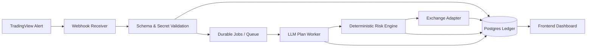
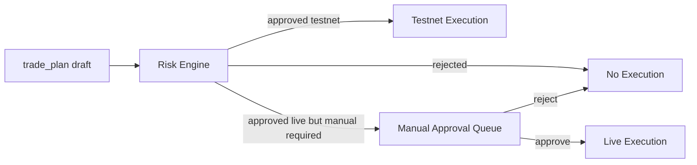
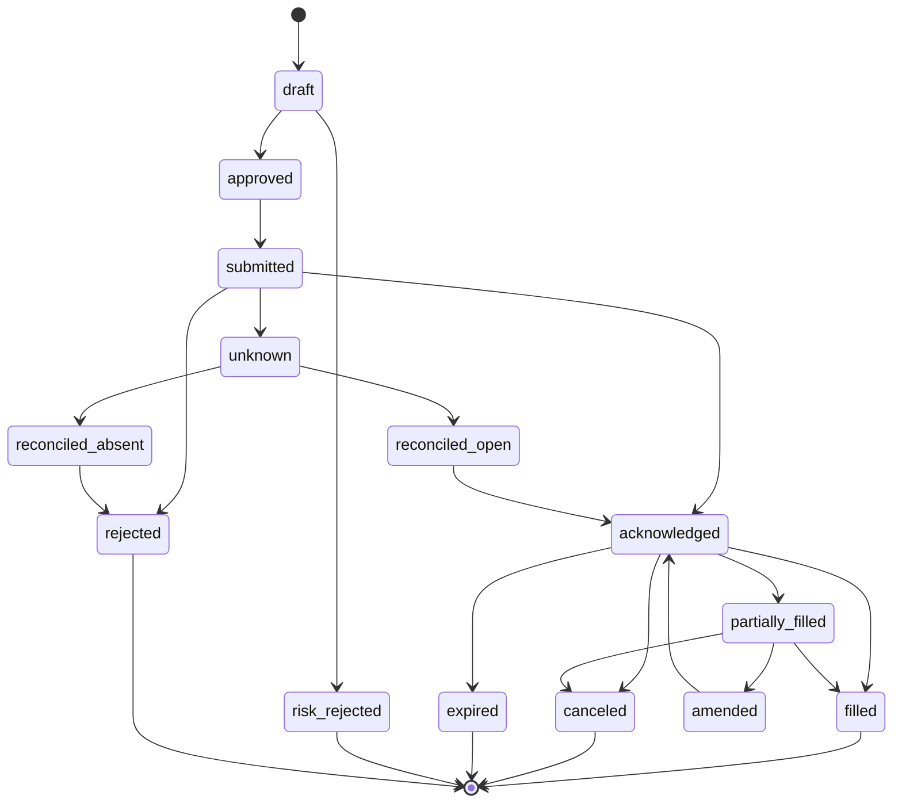

# TradingView 到 LLM 交易执行 MVP 研究报告

> 本文保留研究背景与取舍依据；最终实现契约以 `../freeze/mvp-phase-0-freeze.md` 为准。

## Executive summary

这类系统最准确的定义，不是“AI 自动炒币机器人”，而是**由图表信号驱动、由 LLM 生成交易计划、由确定性风控引擎审批、再由交易所 API 执行的交易自动化基础设施**。你的当前指标已经不只是一个买卖箭头，而是一个把 Regime、Momentum、Oscillator、Signal Scoring、Key-Level 和 Probability 统计压缩成结构化 context 的 webhook 发射器；这意味着 MVP 的核心，不是继续堆指标，而是把**接收、归档、审计、审批、执行、复盘**做成一条稳定链路。fileciteturn0file0 fileciteturn0file1

我最推荐的 MVP 路线是：由 urlTradingViewturn0search0 发 webhook，到 typed ingestion API，经由 Postgres 事件账本与 durable jobs，通过 **Vercel AI Gateway** 调用结构化模型输出，再交给 deterministic risk engine 决定是否允许进入 testnet 或 live execution。之所以要这样做，是因为 TradingView 官方文档明确说明 webhook 本质上是对指定 URL 的 HTTP POST，提醒不要把敏感凭证放进 URL 或消息体，同时还特别说明 alerts 并不是为自动交易而设计；因此系统从第一天起就必须把幂等、重复重放、人工审批、kill switch 和审计日志放在核心，而不是把模型直接接到下单接口上。citeturn0search0turn9search10turn18search7turn18search3

在三套候选架构里，最适合 solo founder 的首选是 **A 方案：urlVercelturn1search1 + urlSupabaseturn15search2 + urlInngestturn1search6 + Vercel AI Gateway**。这套组合的优点是：上手快、后台任务和审计能力够用、前后台一体化开发体验最好，而且固定成本可控。更偏成本优化与 edge-first 的候选是 **B 方案：urlCloudflare Workersturn11search19 + urlCloudflare Queuesturn11search0 + urlCloudflare D1turn11search1 或 Supabase**。更偏后期可控与工程化的是 **C 方案：urlGoogle Cloud Runturn2search12 + urlCloud SQL for PostgreSQLturn2search1 + urlPub/Subturn2search6 + urlSecret Managerturn2search3**。citeturn1search1turn15search0turn1search6turn11search0turn11search1turn2search0turn2search1turn2search6turn2search3

LLM 层面，当前最稳妥的做法不是上来就堆“多 agent 编排”，而是使用 **一个计划生成 agent + 一个确定性 risk engine + 一个执行适配层**。模型访问统一走 AI Gateway，模型输出统一走 Structured Outputs；这样既能保留 provider 切换能力，也能把业务契约固定在 JSON schema 上。Agents SDK 这类框架只有在你需要额外 tracing 或 approvals 能力时再接入即可，MVP 不应先引入复杂编排。citeturn10search0turn10search1turn10search8turn10search15

执行层面，我建议 **先做 testnet 和 paper trading，再做限量 live trading**；首个交易所优先做 **urlBybit API 文档turn6search2**，第二个再接 **urlBinance API 文档turn20search0**，而 **urlOKX API 文档turn17search1** 更适合在账本、风控和对账稳定后再接入。Bybit 的 V5 文档对 testnet、私有流、订单/成交/仓位流和官方 Python SDK 的呈现最统一；Binance 的期货 API 很强，但官方文档也明确提醒某些 503 返回意味着“执行状态未知”，这要求你的执行侧具备更强的对账与幂等能力；OKX 功能最全之一，但 account mode、passphrase、地区/KYC 要求和 demo/live 差异会带来更高的接入复杂度。citeturn6search2turn6search3turn6search4turn6search5turn16search1turn20search0turn20search1turn17search1turn8search1turn18search2

## 项目定义与产品边界

你的项目更适合被定义为：

> **Signal-to-Plan-to-Execution Infrastructure**  
> 或  
> **LLM-assisted, risk-gated trading copilot and execution system**

这个定义有三个好处。第一，它准确反映了系统的真实职责：接收策略信号、整理市场上下文、生成计划、做审批、执行与审计，而不是“替用户判断市场真理”。第二，它天然强调 **LLM 生成的是计划，不是命令**。第三，它允许你把项目文案放在“research / decision support / execution infrastructure”上，而不是站到“投资建议”或“收益承诺”那一侧。你的当前 webhook 结构本身也支持这种定位，因为它输出的不是单一 buy/sell，而是 `summary + detail` 双层 market context。fileciteturn0file0 fileciteturn0file1

冻结版实现里，外部契约以 `../specs/webhook-payload-scheme.md` 的 `context + signal` 为准。

从产品边界看，MVP 必须把“信号自动化”与“投资建议”分开。最好的表述是：**系统根据用户自定义 indicator 和用户自定义 risk limits，生成可审计的执行计划，并在批准条件满足时自动提交订单**。不应该写成“AI 负责判断市场并替你赚钱”，也不应该给出“高胜率”“稳赚”或“最佳点位”这样的营销语言。这不是法律意见，但从产品设计角度，越是减少“个性化建议”“收益承诺”“替客户主观判断买卖”的叙事，越能降低被误解为投顾产品的风险。

你当前的指标特别适合这个定位，因为它已经天然是一个**上下文编码器**。它把行情状态拆成 Regime、Momentum、Oscillator、Signal Scoring、Key-Level、Probability，并通过 `signal.new` / `signal.upgrade` 在 bar close 时发出结构化 JSON。你甚至已经把 Level threshold、cooldown、upgrade-only、no same-bar-flip 等“实际交易前置去噪规则”写进了脚本，所以后端完全可以把 Pine 输出当作**策略事实层**，而不是再让 LLM“看 K 线图片猜市场”。fileciteturn0file0 fileciteturn0file1

MVP 的边界应当严格分层。**必须做**的是：webhook 入库、schema 验证、幂等处理、signal/market snapshot 存储、LLM 计划生成、risk engine 审批、订单提交、执行回执与前端审计。**应该推迟**的是：多 agent 辩论、组合层优化、自动调参、全量向量 RAG、复杂 OMS/EMS、自建回测平台、跨多账户资金调度。**必须先人工确认**的，是 live 模式下的第一阶段开仓、反手、加仓与杠杆变更；testnet 和 paper trading 则可以更快进入自动批准。TradingView 官方对 alerts 的定位与 webhook 安全提醒，也支持这种“先 copilot，再 limited autopilot”的节奏。citeturn18search7turn9search10turn10search0

我建议采用下面这条阶段化边界：

- **Phase 0**：webhook ingestion + storage + signal feed。
- **Phase 1**：LLM 生成 trade plan，但不下单。
- **Phase 2**：dashboard + manual approve + audit log。
- **Phase 3**：paper trading / testnet execution。
- **Phase 4**：单交易所、单策略、低杠杆、低风险 live execution。
- **Phase 5**：多交易所 / 多策略 / 多 timeframe 组合管理。

这样做的关键收益是：你可以在 Phase 2 就拿到一个已经有产品感的系统，而不用等到“自动交易全闭环”才验证价值。

## 架构方案对比

下面是三套适合 MVP 的轻量可扩展架构。它们都遵循同一条主链路，但在“任务执行位置”“数据层复杂度”和“平台锁定程度”上不同。



这张图的核心思想，是把 **信号接收**、**计划生成**、**风控审批**、**执行提交** 和 **观测审计** 明确拆开。TradingView 官方只负责把 alert 通过 webhook 打到你的接收端；后台 durable workflow 负责重试、审计和状态推进；交易所 API 则作为执行真相源。citeturn0search0turn1search6turn1search14turn20search0turn6search3turn17search1

### 方案对照结论

| 方案 | 成本带宽 | 开发难度 | 维护难度 | 安全与审计 | 结论 |
|---|---|---|---|---|---|
| A | 低到中 | 低 | 低 | 好 | **首选** |
| B | 最低 | 中 | 中 | 中上 | 适合极致省钱、接受更多边缘限制 |
| C | 中到中高 | 中 | 中 | 很好 | 适合后期放大，但不是最快 MVP |

### 方案 A

方案 A 是 **urlVercelturn1search1 + urlSupabaseturn15search2 + urlInngestturn1search6 + urlOpenAI APIturn0search5**。它的最大优点是：前端、ingestion API、后台工作流和数据库都可以用非常“现代 SaaS 默认值”的方式搭起来。Vercel Pro 当前公开价格为每月 20 美元；Supabase Pro 的订阅价格为每月 25 美元，并包含计算 credits；Inngest 免费版包含 50k executions/月，Pro 起步是 75 美元/月。对一个单人项目来说，这意味着**最小稳定基线大致在 45 美元/月上下，再加上模型调用成本**；只有当 workflow 明显增长时，Inngest 才会成为额外成本。citeturn1search1turn15search0turn15search1turn1search2

为什么它最适合你。第一，Supabase 本身已经把 Postgres、Auth、Realtime、Storage 放在同一平台里，对仪表板、审计日志、权限隔离特别友好。第二，Inngest 的定位就是 durable execution：它官方强调不需要你自己管理 queues、infra 或执行状态，并且提供 retries、concurrency、throttling 和 observability。第三，OpenAI 官方文档已经把 Responses API 和 Agents SDK 作为当前 agent 构建主路径，新项目直接走这条路径最顺。citeturn15search2turn1search8turn1search6turn10search4turn10search0

它的不足也要说清楚。第一，执行引擎如果后面要升级为**长连接私有流 + 高频重平衡**，纯 SaaS/serverless 组合会开始显得笨重。第二，Vercel 的强项是 web app 与 API，而不是你长时间维持 exchange user stream 的基础设施；虽然这在 MVP 不是硬伤，但在 Phase 4 以后你可能需要额外加一个小型常驻 worker。第三，用户 API key 的安全存储不能只靠“平台环境变量”，还必须做应用层加密。citeturn1search5turn1search21turn10search9

**适用结论**：如果你的目标是 4 到 8 周上线一个可用 MVP，这套方案最平衡。

### 方案 B

方案 B 是 **urlCloudflare Workersturn11search19 + urlCloudflare Queuesturn11search0 + urlCloudflare D1turn11search1 或 urlSupabaseturn15search2 + urlOpenAI APIturn0search5**。它最吸引人的地方是成本：Workers Paid plan 当前最低 5 美元/月，Queues 也已经进入 free/paid 方案，D1 则是按读写与存储计费。理论上，这是三套里最低的固定成本。citeturn1search3turn11search16turn11search9turn11search0

它的问题在于**“足够便宜”不等于“最适合交易账本”**。D1 官方明确是带 SQLite 语义的 serverless SQL 数据库；这对轻量元数据系统很好，但对一个需要复杂关系、JSONB-rich payload、历史审计、风险统计、RLS 和未来分析查询的交易系统来说，Postgres 仍然更稳妥。所以如果你坚持选 B，我反而建议“Cloudflare 做 ingress + queue，数据库仍然用 Supabase Postgres”，而不是把核心账本押在 D1 上。citeturn11search1turn11search13turn15search2turn1search16

B 方案的另一个现实问题，是 edge 环境非常适合 webhook ingest 和轻量队列消费者，但当你需要做更多 SDK 兼容、私有流管理、订单重试与对账时，工程上的“边缘限制意识”会变强。你可以做出来，但开发心智负担比 A 更高。citeturn11search0turn11search22turn11search15

**适用结论**：如果你极度在意前期固定成本，或者你对 Cloudflare 生态非常熟悉，可以选；否则它更适合作为第二选择。

### 方案 C

方案 C 是 **urlGoogle Cloud Runturn2search12 + urlCloud SQL for PostgreSQLturn2search1 + urlPub/Subturn2search6 + urlSecret Managerturn2search3 + urlOpenAI APIturn0search5**。它的优点是：Cloud Run 本身按用量计费、支持自动扩缩容；Cloud SQL 是全托管 PostgreSQL；Pub/Sub 是成熟的消息总线；Secret Manager 是标准 secrets 方案。对于交易系统这类“最终可能变得更稳、更长驻”的服务，这套组合非常扎实。citeturn2search0turn2search4turn2search1turn2search6turn2search3

但它不适合作为你的第一发 MVP。原因很简单：你想要的是**快、轻、易维护**。Cloud Run 本身不贵，但 Cloud SQL 不是纯粹的 scale-to-zero 请求计费产品，它是受实例类型影响的托管数据库；这会让系统的最低稳态成本和运维心智都高于 A/B。换句话说，C 适合在你已经证明产品方向后，作为“第二次架构升级”，而不是第一个版本。citeturn2search0turn2search5turn2search9

**适用结论**：如果你一开始就确定会很快进入多 worker、常驻执行、严格 secrets、企业级审计，那 C 很合理；但如果你目前仍处在 MVP 设计期，就不应优先。

## 推荐技术栈

下面这套栈，是我认为最符合你“主流、轻量、易开发、易维护、可扩展、不去过度工程化”的组合。

| 层 | 推荐 | 说明 |
|---|---|---|
| 前端 | urlNext.jshttps://nextjs.org + urlReacthttps://react.dev + urlTailwind CSShttps://tailwindcss.com + urlshadcn/uihttps://ui.shadcn.com | 仪表板、审批界面、审计列表和实时状态都够用，开发速度最快。 |
| 后端 API | Next.js Route Handlers；若后面需要重 Python 生态，再加 urlFastAPIhttps://fastapi.tiangolo.com 侧车 | MVP 阶段不要拆两套后端；先让 ingestion、dashboard、admin API 在同仓库。 |
| 数据库 | urlSupabase Postgresturn15search2 | Postgres、Auth、Realtime 一体化，对事件账本与前端很好。 |
| Auth | urlSupabase Authturn1search8 | 自带用户、session、email/magic link，配合 RLS 很自然。 |
| ORM | urlPrismaturn3search6 | 对 solo founder 友好，migrations、client、studio 成熟。Drizzle 更轻，但第一版未必更省脑力。 |
| 队列 / Job | urlInngestturn1search6 | 把 retries、concurrency、scheduling、human approval 流转交给 durable workflow。 |
| LLM API | Vercel AI Gateway + Responses-compatible client | 模型作为配置项，统一走结构化输出与路由策略。 |
| Agent 框架 | 先自研状态机；若要 tracing/approval，可接入 urlOpenAI Agents SDKturn10search0 | MVP 不建议直接上复杂多 agent 图编排。 |
| 部署 | urlVercelturn1search1 | 前端和轻 API 最顺手。 |
| 监控 | urlSentryturn3search8 | 错误、Tracing、Logs、Cron/Uptime 足够做第一版观测。 |
| Secrets | Vercel env vars + 应用层密钥加密；后续可迁移到 urlGoogle Secret Managerturn2search3 或 urlCloudflare Workers secretsturn11search3 | 平台 secrets 只适合系统级密钥；用户交易所 key 必须单独加密存储。 |

这套栈的理由并不是“技术最先进”，而是**认知负担最低**。Supabase 官方首页和文档都把 Postgres、Auth、Realtime、Storage 作为一体化平台能力；Vercel 公开提供环境变量、Web 应用托管和按使用扩展的函数能力；Inngest 则直接把“durable workflows”作为它的定位，主打不用自己管理队列与状态。它们组合在一起，很适合把你的精力集中到交易系统真正困难的部分：数据约束、风控、执行与审计。citeturn15search2turn1search16turn1search8turn1search21turn1search13turn1search6turn1search14

关于模型与 agent 选择，建议不要把模型名硬编码进业务逻辑。MVP 只需要两类模型策略：**plan.generate** 和 **plan.update**。前者可用更强模型，后者可用更快更便宜的模型；dashboard 摘要优先从结构化计划直接渲染，先不要再引入第三次模型调用。citeturn0search17turn10search1turn10search2

还有一个关键建议：**不要为了“agent”而引入额外数据库或向量库**。在你的 MVP 阶段，记忆最应该来自 Postgres 里的 recent snapshots、previous plan、open orders、positions 和 risk limits，而不是来自 embeddings。把记忆做成关系查询，比做成通用 RAG 更便宜、更可解释，也更容易审计。

## 数据库设计

你的数据库不应被设计成“聊天记录库”，而应被设计成**事件账本 + 计划版本库 + 执行账本**。之所以要分成这三层，是因为交易系统的可解释性来自“收到什么”“计划过什么”“最后执行了什么”三件事彼此可追溯。交易所官方 API 也天然按 order / execution / position 的模式暴露私有流，所以数据库最好沿用这种拆法。citeturn6search3turn6search4turn6search5turn20search0turn17search1

### 核心表设计

| 表名 | 核心字段 | 说明 | 主要关联 |
|---|---|---|---|
| `users` | `id`, `email`, `display_name`, `role`, `status`, `created_at` | 平台用户 | 1:N `strategies`, 1:N `trading_accounts` |
| `strategies` | `id`, `user_id`, `name`, `description`, `source`(`tradingview`), `primary_symbol_scope`, `primary_timeframe`, `autopilot_mode`, `is_active`, `created_at` | 策略/指标实例配置 | N:1 `users`; 1:N `signal_events`, `trade_plan_versions` |
| `trading_accounts` | `id`, `user_id`, `venue`, `label`, `account_type`, `testnet`, `api_key_ciphertext`, `api_secret_ciphertext`, `passphrase_ciphertext`, `permissions_json`, `ip_allowlist_json`, `status`, `created_at`, `last_verified_at` | 交易所账户连接 | N:1 `users`; 1:N `orders`, `positions`, `portfolio_state` |
| `webhook_events` | `id`, `strategy_id`, `source`, `schema_version`, `delivery_key`, `payload_hash`, `tickerid`, `timeframe`, `bar_time`, `event_type`, `raw_payload_jsonb`, `headers_jsonb`, `received_at`, `is_duplicate`, `process_status` | 原始入站 webhook 账本 | N:1 `strategies`; 1:1/1:N 派生到 `market_states_history`, `signal_events` |
| `market_states_current` | `market_key`, `tickerid`, `timeframe`, `bar_time`, `context_jsonb`, `updated_at` | 最新闭盘状态 | 由 `market_states_history` 汇总 |
| `market_states_history` | `id`, `webhook_event_id`, `tickerid`, `timeframe`, `bar_time`, `context_jsonb`, `created_at` | 历史闭盘状态 | N:1 `webhook_events` |
| `signal_events` | `id`, `strategy_id`, `webhook_event_id`, `tickerid`, `timeframe`, `bar_time`, `direction`, `signal_jsonb`, `created_at` | 标准化信号事件 | N:1 `strategies`; N:1 `webhook_events`; 1:N `agent_runs`, `trade_plan_versions` |
| `agent_runs` | `id`, `strategy_id`, `signal_event_id`, `run_type`, `status`, `model`, `provider`, `prompt_version`, `input_snapshot_jsonb`, `output_jsonb`, `reasoning_summary`, `trace_id`, `token_usage_jsonb`, `started_at`, `ended_at`, `error_jsonb` | 每一次模型运行 | N:1 `strategies`; N:1 `signal_events`; 1:N `trade_plan_versions` |
| `trade_plan_versions` | `id`, `plan_id`, `version`, `strategy_id`, `signal_event_id`, `agent_run_id`, `action`, `market_thesis_jsonb`, `execution_playbook_jsonb`, `risk_intent_jsonb`, `reasoning_summary`, `evidence_jsonb`, `created_at` | 计划版本库 | N:1 `strategies`; N:1 `signal_events`; N:1 `agent_runs` |
| `plan_transitions` | `id`, `plan_id`, `version`, `from_state`, `to_state`, `reason_code`, `created_at` | 计划状态变更 | N:1 `trade_plan_versions` |
| `risk_verdicts` | `id`, `trade_plan_version_id`, `trading_account_id`, `verdict`, `approved_risk_pct`, `approved_qty`, `approved_notional`, `approved_stop_price`, `checks_jsonb`, `rejection_codes_jsonb`, `require_human_approval`, `created_at` | 风控审批结果 | N:1 `trade_plan_versions`; N:1 `trading_accounts` |
| `execution_intents` | `id`, `trade_plan_version_id`, `risk_verdict_id`, `trading_account_id`, `action`, `mode`(`paper`,`testnet`,`live`), `idempotency_key`, `payload_jsonb`, `approved_by_user_id`, `created_at` | 经批准的执行意图 | N:1 `trade_plan_versions`; N:1 `risk_verdicts`; N:1 `trading_accounts` |
| `orders` | `id`, `execution_intent_id`, `trading_account_id`, `venue`, `symbol`, `side`, `order_type`, `time_in_force`, `reduce_only`, `client_order_id`, `exchange_order_id`, `status`, `requested_qty`, `requested_price`, `stop_price`, `avg_fill_price`, `filled_qty`, `submitted_at`, `last_exchange_update_at`, `terminal_at`, `raw_exchange_jsonb` | 订单主表 | N:1 `execution_intents`; N:1 `trading_accounts`; 1:N `fills` |
| `fills` | `id`, `order_id`, `exchange_fill_id`, `price`, `qty`, `fee`, `fee_ccy`, `liquidity_role`, `filled_at`, `raw_jsonb` | 成交明细 | N:1 `orders` |
| `positions` | `id`, `trading_account_id`, `strategy_id`, `symbol`, `side`, `qty`, `entry_avg_price`, `mark_price`, `liq_price`, `unrealized_pnl`, `realized_pnl`, `status`, `opened_at`, `closed_at`, `last_reconciled_at`, `raw_jsonb` | 仓位状态 | N:1 `trading_accounts`; N:1 `strategies` |
| `portfolio_state` | `id`, `trading_account_id`, `as_of_ts`, `equity`, `available_balance`, `margin_used`, `open_notional`, `daily_pnl`, `drawdown_pct`, `consecutive_loss_count`, `trading_paused`, `source_jsonb` | 账户层快照 | N:1 `trading_accounts` |
| `risk_limits` | `id`, `user_id`, `strategy_id`, `trading_account_id`, `max_trade_risk_pct`, `max_trade_loss_usd`, `max_leverage`, `max_position_notional`, `max_daily_loss_pct`, `max_consecutive_losses`, `cooldown_minutes`, `allow_reverse`, `require_sl`, `require_reduce_only_on_exit`, `live_requires_manual_approval`, `is_active` | 风控规则配置 | 作用于 `risk_verdicts` |
| `audit_logs` | `id`, `actor_type`, `actor_id`, `entity_type`, `entity_id`, `action`, `severity`, `before_jsonb`, `after_jsonb`, `metadata_jsonb`, `created_at` | 全链路审计日志 | 关联所有关键表 |

### 关联与约束建议

数据库层面，最重要的不是字段多，而是**唯一约束和版本关系**。建议你至少做下面这些约束：

- `webhook_events.delivery_key` 唯一。
- `market_states_history(tickerid, timeframe, bar_time)` 唯一。
- `signal_events(strategy_id, tickerid, timeframe, bar_time)` 唯一。
- `trade_plan_versions(plan_id, version)` 唯一。
- `plan_transitions(plan_id, version, to_state)` 唯一。
- `execution_intents.idempotency_key` 唯一。
- `orders(venue, client_order_id)` 唯一。
- `fills(venue, exchange_fill_id)` 唯一。

这样做的结果是：即使 webhook 重放、队列重试、执行超时重入，也更容易做到**写幂等**而不是“应用层靠 if 判断”。

## Webhook 与 Agent 流程设计

### Webhook 处理流程

TradingView 官方说明 webhook 的本质是对你的 URL 发起 POST，请求的成功与否经常取决于接收服务器；它还给出了常见发送错误与 webhook 认证/安全说明。因此，接收层必须把它当成一个**不保证 exactly-once、也不自带完整业务语义**的入口。通用 webhook 最佳实践同样强调要做幂等与重复处理。citeturn0search0turn0search16turn18search3turn9search2turn9search4

我建议把 webhook pipeline 设计成下面这条线：

1. 接收端只做三件事：**验证、标准化、落库**。  
2. 一旦通过验证，立即把原始 payload 和 headers 写入 `webhook_events`。  
3. 把后续重活全部丢给 durable jobs。  
4. 即使发现重复，也返回 `200 OK`，避免上游持续重发。  
5. 所有副作用都在异步 worker 中完成，而不是在 HTTP 请求生命周期里完成。  

这能最大化降低 webhook 入口因为网络波动、解析异常或下游服务慢导致的丢单风险。citeturn1search6turn1search14turn0search16

建议的校验顺序如下：

- **HTTPS only**。  
- **源校验**：启用 TradingView 提供的 SSL 证书校验思路，并根据官方文档提供的 IP 列表做 allowlist。  
- **共享密钥校验**：因为 TradingView 不像 Stripe 那样给你官方签名头，所以 MVP 阶段采用你自己的 `webhook_secret` 字段或 header，并使用常量时间比较。  
- **Schema validation**：按 `schema_version` 选择 Zod/Pydantic 解析器。  
- **标准化**：把外部 payload 映射为内部 canonical event，例如 `core.signal_event.v1`。  
- **写入幂等键**：主键用 canonical 字段组合生成。  

TradingView 官方还专门提醒不要把登录凭证或密码放进 webhook URL/message，所以你的 `webhook_secret` 必须是**专用随机共享密钥**，而不是账户密码、交易所密钥或其他可复用凭证。citeturn9search7turn9search10turn18search7turn9search0

### 幂等、重复、乱序与重发

建议使用两个键：

- **业务事件键**：`event_key = source + tickerid + timeframe + bar_time + event_type + direction + level`
- **投递键**：`delivery_key = sha256(raw_payload_normalized)`

业务事件键解决“同一 K 线同一信号被重发”；投递键解决“完全相同 payload 被重复送达”。如果出现旧 bar 的 `signal.upgrade` 在新 bar 之后才到达，你也不应丢弃它，而应标记为 `out_of_order` 并禁止其触发新的执行副作用。这样以后复盘时你仍能看到真实的传输顺序问题。

为了更稳，建议在 `signal_events` 上增加一个 `superseded_by_signal_event_id` 字段。当同一 `bar_time` 先收到 `signal.new`、后收到 `signal.upgrade` 时，前者不删除，而是被标记 superseded。这样前端可以完整展示“该信号如何升级”的历史。

### 多 timeframe 聚合

你的系统若要真正利用当前指标的 context 价值，必须做**闭盘快照聚合**，而不是让 LLM 每次只看单个 4h alert。推荐做法是：

- 主触发 timeframe 先做一个，例如 4h。
- 再额外为 1h 和 1d 设置 `snapshot.close` 类型 alert，内容更轻，只发送 market/regime/structure/context 摘要。
- 后端 agent 运行时，拉取**不晚于当前触发 bar_time 的最近闭盘快照**：
  - `1h latest_closed <= 4h.bar_time`
  - `4h current`
  - `1d latest_closed <= 4h.bar_time`

这样你可以避免“高周期还没收盘，低周期已经把它当成事实”的数据污染。

`snapshot.close` 是否需要存储。我的建议是：**需要**，但只存你真正会用到的 timeframe。没有快照，LLM 就只能围绕 signal event 做一次性判断；有快照，才能做 plan update、方向一致性检查和持仓跟踪。

### Payload versioning

不要让 agent 直接绑定外部 schema。建议做两层版本：

- 外部版本：`bitpunk.webhook.v11`
- 内部版本：`core.signal_event.v1`

外部版本由 Pine script 演进；内部版本由后端契约演进。这样 Pine 以后改字段名、增删细节时，你只要改 parser 和 adapter，不需要改 agent 主逻辑。

### Agent 设计原则

LLM 这一层的目标，不是“模拟基金经理”，而是**在严格输入边界内写出结构化、可审计、可被 risk engine 消费的计划对象**。OpenAI 当前文档把 Responses API、Function Calling 和 Structured Outputs 放在同一开发主线上，而 Agents SDK 也明确适用于你自己掌控状态、工具和 approvals 的场景。citeturn10search4turn10search2turn10search1turn10search0

#### Agent 输入

建议输入分成六块：

```json
{
  "signal_event": {},
  "market_states": {
    "primary_tf": {},
    "higher_tf": [],
    "lower_tf": []
  },
  "strategy_state": {
    "active_plan": {},
    "open_orders": [],
    "open_position": {}
  },
  "probability_context": {},
  "risk_limits": {},
  "venue_capabilities": {}
}
```

关键原则是：**不给模型自由访问实时行情网页，也不给它访问原始 Pine 全量输出**。你只给它经过标准化、白名单过滤后的 canonical context。这样才便于审计，也能减少 prompt injection 面积。citeturn10search9turn10search17turn10search2

#### Agent 输出 schema

计划对象以最新的 `trading-agent-design` 为准，只保留三层：市场判断、执行剧本、风险意图。这样 agent 负责“值不值得做”，risk engine 负责“最多能做多大”。

```json
{
  "action": "create | keep | patch | terminate | skip",
  "market_thesis": {
    "bias": "long | short | neutral",
    "environment": "trend | range | transition | exhaustion",
    "htf_bias": "bull | bear | neutral",
    "mtf_bias": "bull | bear | neutral",
    "bias_confidence": 0.0,
    "trend_end_score": 0.0,
    "structure_summary": "",
    "key_levels": []
  },
  "execution_playbook": {
    "state": "watch | armed | pending_entry | entered | managing | exit_only | closed | invalidated | expired",
    "entry_style": "pullback | breakout_retest | range_edge | probe",
    "entry_zone": {
      "low": null,
      "high": null,
      "source": "structure | atr_band | exec_tf_setup"
    },
    "allowed_triggers": [],
    "requires_signal": true,
    "disqualifiers": [],
    "tp_style": "ladder | dynamic_trail | range_mean_revert",
    "update_policy": "minor_patch | major_patch | replace_only"
  },
  "risk_intent": {
    "risk_tier": "probe | starter | standard | high_conviction",
    "suggested_max_account_risk_pct": 0.0,
    "stop_anchor": "swing_low | swing_high | key_level_break | range_edge_break",
    "stop_buffer_atr": 0.0,
    "rationale_codes": []
  },
  "reasoning_summary": "",
  "evidence": []
}
```

#### System prompt

```text
你是一个交易计划生成器，不是执行器，也不是投资顾问。
你只能使用输入的 payload、数据库上下文、持仓与风控限制。
你不能编造未给出的价格、指标、成交量、订单簿或新闻。
如果信息不足，你必须选择 watch 或 skip，而不是强行 trade。
你的输出必须完全符合 JSON schema。
你不拥有下单权限；你的建议会被 deterministic risk engine 审批。
```

#### Developer prompt

```text
严格遵守以下规则：
1. 只引用输入中存在的字段。
2. 不得虚构价格、结构位、成交量、订单簿或新闻。
3. 不得建议无止损开仓。
4. 如果已有 active_plan，优先返回 keep / patch / terminate，而不是新建相互冲突的计划。
5. 如果 signal 与 higher timeframe 明显冲突，优先保持 watch 或输出 skip。
6. 如果证据不足，必须输出 skip，而不是为了满足 schema 强行开仓。
7. 不得输出任何自由文本说明在 JSON 对象之外。
```

#### 计划更新 prompt

```text
你正在更新一个已经存在的交易计划。
请比较 current_signal_context 与 active_plan。
如果原始 thesis 仍有效，优先返回 keep 或 patch。
如果 thesis 已失效，返回 terminate。
必须指出“与上一版相比，有什么发生了变化”。
```

#### No-trade prompt

```text
如果没有足够依据支持开仓，请输出 skip，并让 execution_playbook.state 保持 watch。
你必须说明：
- 为什么不值得交易
- 哪些后续条件满足后才值得更新计划
- 当前风险不对称来自哪里
```

### 避免幻觉与 memory 策略

避免幻觉最有效的方式，不是“写更长 prompt”，而是**缩小输入面 + 用结构化输出 + 在数据库写回前再做验证**。Structured Outputs 保障的是 schema 对齐，不是真实性本身，所以应用层仍必须做二次校验，例如：

- `action=create` 时，必须存在可解释的 `market_thesis`、`execution_playbook` 和 `risk_intent`。
- `market_thesis.bias=neutral` 时，不得直接进入执行态。
- `risk_intent.suggested_max_account_risk_pct` 不得超过 risk limit。
- 若 entry zone 为空，则计划只能处于 `watch`，不能生成执行意图。  

OpenAI 官方文档同时强调 function calling / tool calling 是把模型接到外部系统的主方式，而 prompt injection 又是一个持续演进的问题；所以你的模型不应直接拥有“任意执行”工具，只应被允许返回结构化计划。citeturn10search1turn10search2turn10search9turn10search17

MVP 阶段不建议做“向量 RAG”。更合理的 memory 是：

- `active_plan`
- 最近 20 个同 symbol/timeframe `signal_events`
- 最近 5 次 `trade_plan_versions`
- 当前 `open_orders`
- 当前 `position`
- 最近的 `portfolio_state`

它们本质上都是**短期操作记忆**，最适合直接从 Postgres 查出来拼成输入。等以后做跨策略复盘，再考虑向量检索。

## 风控与执行设计

### Deterministic Risk Engine

这部分是全系统最不能妥协的层。LLM 可以输出“建议”，但**只有 risk engine 可以输出“允许执行”**。其最小规则集应当包括：

- 单笔最大账户风险 `%`
- 单笔最大亏损 `USD`
- 最大杠杆
- 最大名义仓位
- 每 symbol 最大同时挂单数
- 每日最大亏损
- 最大连续亏损次数
- 新计划 TTL
- 必须有 SL
- 退出类订单必须 `reduce_only`
- 不允许裸奔反手
- live 默认需要人工批准
- kill switch 生效时，拒绝所有新开仓，仅允许减仓/平仓

这个层应完全不依赖模型推理。它接收 `trade_plan_version`，读取 `risk_limits`、`portfolio_state`、`positions`、`orders` 和 `venue_capabilities`，给出 `risk_verdicts`。你可以把它实现成纯 TypeScript 规则引擎，甚至加上 unit tests，使其在不访问模型的情况下可完全复现。这样一来，调试失败交易时，你知道到底是“模型判断有问题”，还是“风控拒绝了”。

### 审批流程

推荐的审批顺序只有一条：



这条线能让你把 `copilot` 与 `autopilot` 清晰分开。**copilot** 模式下，所有 live 新开仓都进人工审批队列；**autopilot** 模式下，也只允许经过白名单条件的动作自动执行，例如单 symbol、单策略、低杠杆、低账户风险、非反手、非追单。其余动作仍然进人工审批。

### 交易所执行引擎比较

下面的表是结论型摘要，后面我分别解释。

| 交易所 | 优点 | 风险点 | MVP 建议 |
|---|---|---|---|
| Bybit | 文档统一、testnet 清晰、私有流完整、官方 Python SDK | 仍需关注地区域名与账户模式 | **首选** |
| Binance | 期货 API 强、testnet 可用、reduceOnly/closePosition 完整 | 503 可能表示“执行状态未知”，SDK 官方性较弱 | **第二个接入** |
| OKX | API 能力广、demo trading 好、账号/权限/安全文档完整 | account mode、KYC、地区规则和字段复杂度更高 | **后接入** |

#### Bybit

urlBybit API 文档turn6search2 的 V5 体系，对 MVP 非常友好。官方文档明确给出 testnet 基础 URL `https://api-testnet.bybit.com`，并列出了官方 Python、Go、Java、.NET SDK 与社区 Node SDK。下单接口支持 market/limit、IOC/FOK/PostOnly，并支持在下单时附带 TP/SL。私有 WebSocket 侧又直接提供了 `order`、`execution`、`position` 和 `wallet` 等通道。citeturn6search2turn16search1turn6search1turn6search3turn6search4turn6search5turn6search6

为什么它适合作为第一家。因为对于 MVP，最重要的不是“理论上支持最多功能”，而是“下单、改单、查单、成交、仓位变更和失败恢复是不是统一”。Bybit 在这件事上给人的负担最小。再加上它有 DCP 机制相关通道，这对后期做断线保护也有帮助。需要注意的是，Bybit 也有明确的 HTTP / WebSocket IP 限流规则，所以任务系统必须内建节流器。citeturn6search7turn6search0

**推荐策略**：MVP 先做 Bybit testnet 的 HTTP submit + REST reconcile；private WebSocket 放到第二阶段，用于降低状态收敛延迟，而不是作为第一天的必要依赖。citeturn6search3turn6search4turn6search5turn6search6

#### Binance

urlBinance API 文档turn20search0 的优势在于期货接口很完整。官方明确写了 USDⓈ-M Futures testnet 的 REST 基础地址 `https://demo-fapi.binance.com`，WebSocket testnet 也有单独 base URL；下单参数中有 `reduceOnly`、`closePosition`、`newClientOrderId`，还有单独的 `algoOrder` 能处理 TP/SL 和 trailing stop。citeturn20search0turn20search1turn12search3turn5search4

但 Binance 的执行层更考验你。官方文档明确指出，某些 HTTP 503 的含义是“请求可能已经成功，但后端来不及在超时内返回”，因此执行状态是 **UNKNOWN**，正确处理方式不是盲目重试，而是先通过 WebSocket 更新或查单核验，避免重复开仓。对自动执行系统来说，这是非常重要的差异点。另一个现实问题是，Binance 文档对于 SDK 的表述更保守，明确提示很多 SDK 是 partner/user 提供而非官方生产。citeturn20search0turn16search4

**推荐策略**：把 Binance 放到第二个接入。等你的 `orders` / `fills` / `positions` 对账链跑稳之后，再把它作为第二 venue 加进去。届时一定要把“unknown execution state reconciliation”做成标准流程。

#### OKX

urlOKX API 文档turn17search1 的能力非常广，demo trading 也成熟。官方文档明确给出 demo trading 的接入方式，要求在请求中增加 `x-simulated-trading: 1` 头，并说明 demo trading API key 不会因 inactivity 过期。它还给出了 Python SDK 与教程入口，并且对 API key 权限、IP 绑定、passphrase、时间同步和 rate limit 讲得很细。citeturn8search1turn17search1

OKX 的问题不在于能力不足，而在于**第一版接入复杂度更高**。你要处理 `tdMode`、account mode、passphrase、共享 rate limits、instrument-level 限流，以及某些 live-only 的 KYC 要求。官方 changelog 里甚至直接写了 live trading 下 KYC level 2 的要求。再加上 OKX 文档明确区分 Read / Trade / Withdraw 权限、建议绑定 IP，并对未绑 IP 的交易/提现 key 设置 inactivity 失效规则，这些都意味着它更像一家“规则明确但接入门槛更高”的 venue。citeturn17search1turn7search1turn12search4turn18search2turn18search6

**推荐策略**：把 OKX 放在 Phase 4 以后，作为“第二阶段规范化接入”的交换所，而不是 MVP 首发。

### 建议的执行状态机



这个状态机专门吸收了 Binance 的“unknown execution state”、Bybit 的私有订单/成交流、以及 OKX 的改单/撤单/共享限流等现实情况，因此比“下单成功/失败”二分法健壮得多。citeturn20search0turn6search3turn6search4turn7search1

## 前端、观测、安全与合规

### Frontend Dashboard MVP

你的前端第一版不需要花哨，但必须把“系统现在在干什么”说清楚。建议至少做下面几页：

| 页面 | 必看字段 | 可操作项 |
|---|---|---|
| `Signal Feed` | symbol, timeframe, event_type, level, score, regime, KL, probability samples/hit rate, duplicate flag, received_at | 查看原始 payload、重放 agent run |
| `Trade Plan Detail` | decision, direction, confidence, thesis, entry/SL/TP, invalidation, follow-up, supersedes version | approve / reject / supersede |
| `Agent Runs` | model, prompt_version, status, latency, token usage, reasoning summary, trace id | 重新运行、查看输入快照 |
| `Risk Review` | passed checks, failed checks, approved size/notional, leverage cap, rejection codes | override（仅管理员）、pause strategy |
| `Orders & Positions` | order state, reduce_only, client_order_id, exchange_order_id, fills, avg fill, realized/unrealized PnL | cancel, flatten, sync |
| `Portfolio Overview` | equity, available balance, open risk, daily pnl, drawdown, consecutive losses | global pause / kill switch |
| `Manual Approval Queue` | pending live actions, risk notes, plan summary, urgency | approve / reject |
| `Settings` | strategy mode, account mapping, risk limits, webhook secret rotation, API key status | update config |
| `Audit Log` | actor, action, entity, before/after diff, created_at | 导出 |

在 MVP 阶段，最值得做好的不是“高级图表”，而是 `Signal Feed → Trade Plan → Risk Review → Order/Position → Audit` 这条跳转链。因为用户真正需要的是：一眼看出**为什么开、为什么没开、为什么减仓、为什么被拒绝**。

### Observability 与 Agent thinking 展示策略

你提到希望前端看到 agent 的全部行为和 thinking。产品上，我建议你**不要直接暴露原始 chain-of-thought**，而要暴露下面这些结构化痕迹：

- `reasoning_summary`
- `evidence_refs`
- `input_snapshot_hash`
- `prompt_version`
- `plan_diff_vs_previous`
- `risk_rule_results`
- `tool_calls` 名称、参数摘要、开始/结束时间
- `retry_count`
- `exchange_request_id`
- `exchange_response_code`

这比原始“思维过程”更有用，原因有两点。第一，用户真正需要的是决策依据和可追责链，而不是模型的全部内部推演。第二，OpenAI 当前的 agent 路线强调 tracing、approvals 和 evals，这意味着更好的做法是以**trace** 和 **summary** 为基本观测单元，而不是把原始隐式推理直接展示到 UI。citeturn10search0turn10search4turn10search23

一个实用的展示规则是：

- **展示**：摘要、证据字段、计划变化、触发的风控规则、系统动作时间线。
- **隐藏**：系统 prompt 原文中的敏感策略、任何 secret、用户 API key、未经清洗的长推理文本。
- **保留后台**：prompt 模板版本、完整输入对象、完整模型输出、所有异常与重试日志。
- **默认给用户看**：`market_thesis.structure_summary` + `reasoning_summary` + `triggered_rules`.
- **管理员模式可看**：更多 trace 细节与 raw JSON。

### 安全建议

安全边界有四条是不能妥协的。

第一，**TradingView 不是签名 webhook 提供方**。它提供的是 HTTPS POST、证书验证思路和 IP allowlist 信息，但不是像 Stripe 那样给你一个官方签名头。因此你的 webhook 接收端必须同时启用 HTTPS、IP allowlist、共享 secret、严格 schema 验证和幂等落库；而且绝对不要把密码或交易所密钥放到 TradingView 消息体中。citeturn18search3turn9search10turn18search7turn9search0

第二，**交易所 API key 必须最小权限**。OKX 官方文档明确把 key 权限分成 Read / Trade / Withdraw，并强烈建议绑定 IP；Binance 官方安全文章也明确建议给 API keys 限制 IP；OKX 还会对未绑定 IP 且具备交易/提现权限的 key 施加 inactivity 过期规则。对你的平台来说，这意味着默认配置必须是：`Trade` 允许、`Withdraw` 禁用、优先绑定固定出口 IP、testnet 默认开启。citeturn17search1turn18search6turn18search0turn18search16

第三，**模型绝不能直接接触密钥和自由执行工具**。OpenAI 关于 prompt injection 的官方文章明确指出，这是一个持续演进的安全挑战。因此，你应当把来自 indicator 和数据库的上下文都视为“不可信输入”，只允许模型输出结构化计划对象，绝不允许模型从自由文本中直接构造交易所 API 调用。工具调用参数应由应用层根据 schema 做白名单映射。citeturn10search9turn10search2turn10search1

第四，**要处理 provider-side data retention**。OpenAI 的迁移文档说明 Responses 默认会存储响应；如果你不希望某些订单或账户上下文在提供方侧被保留，就应显式设置 `store: false`。这对含有账户状态、持仓和执行细节的 trading workload 很重要。citeturn10search15

### 合规与文案边界

这不是法律意见，但从产品边界与风险暴露角度，我建议：

- 对外定义为“交易自动化基础设施”“策略执行工作台”“风险门控的后端执行系统”。
- 不承诺收益，不写“最佳交易点位”“AI 替你判断市场”“稳赚”。
- 默认 testnet / paper trading。
- live 入口单独二次确认，并在 onboarding 中明确风险。
- 所有下单都由用户自己的交易所账户和 API key 发起；平台不代持资金。
- 规则页面明确写出：模型输出是计划建议，最终由风控引擎与用户批准决定是否执行。
- landing page、ToS、risk disclosure、jurisdiction gating 在 live 前必须请本地律师审查。

TradingView 官方自己就提醒 alerts 不是为自动交易而设计，这进一步说明你的产品文案应强调“用户定义策略 + 风控门控 + 执行基础设施”，而不是“平台自己提供可依赖的交易判断”。citeturn18search7

## 路线图与最终建议

### MVP 路线图

下面给出一条 6 周版路线图。它基本符合你要的 4 到 8 周区间，也能最大化前期产出密度。

| 周期 | 目标 | 主要产出 | 测试重点 | 验收标准 |
|---|---|---|---|---|
| 第 1 周 | webhook ingress 与规范化入库 | `/webhooks/tradingview`、schema parser、`webhook_events`、`market_states_history`、`signal_events` | schema 校验、secret 校验、幂等、重复/乱序 | 同一事件重放不产生重复副作用 |
| 第 2 周 | Signal Feed 与事件账本 | 前端 signal feed、raw payload viewer、event detail 页 | UI 正确展示、搜索筛选、延迟可视化 | 能按 symbol/timeframe/bar_time 回看任一事件 |
| 第 3 周 | LLM plan generation | `agent_runs`、`trade_plan_versions`、structured outputs、plan detail 页面 | schema 合法性、空值处理、plan update | 每个 `signal.new` 都能生成可解析 plan 或 skip |
| 第 4 周 | deterministic risk engine + manual approve | `risk_verdicts`、approval queue、kill switch、risk limits UI | 规则覆盖、边界条件、拒单原因可解释 | 未通过风控的计划绝不进入执行层 |
| 第 5 周 | testnet execution + reconciliation | `execution_intents`、`orders`、`fills`、`positions`、testnet adapter | 下单、改单、撤单、部分成交、对账恢复 | testnet 全链路可跑通，异常可恢复 |
| 第 6 周 | 安全加固与 limited live gate | API key 加密、审计日志、`store:false`、出错告警、live guardrails | webhook 安全、数据泄露面、审批与 rollback | 单策略、单账号、低风险 live ready |

如果你压缩到 4 周，那么应当删除两件事：多 timeframe 快照与第二家交易所接入。如果你拉到 8 周，则把多 timeframe 聚合、周报复盘、回放工具和一套基础 evals 加进去会更值。OpenAI 官方对 evals 和 traces 的定位本来就是“上线后持续改进 agent 的必要环节”，所以这部分完全适合放在 MVP 后半段。citeturn10search23turn10search10

### Final recommendation

我的**首选架构**是：

- Web / Dashboard / Light API：urlVercelturn1search1
- Database / Auth / Realtime：urlSupabaseturn15search2
- Durable workflows：urlInngestturn1search6
- LLM：Vercel AI Gateway + Structured Outputs
- 监控：urlSentryturn3search8
- 首个交易所：urlBybit API 文档turn6search2（testnet 起步）

我选择它的理由，不是因为它最“极客”，而是因为它最接近**4 到 8 周内可交付**。Supabase 帮你把 Postgres 与 Auth 一起拿下，Inngest 帮你吃掉 durable jobs 的复杂度，Vercel 让前端与 API 一体推进，OpenAI 把结构化输出做好，Bybit 则提供了一个最容易做出完整 testnet 闭环的交易所文档与私有流生态。citeturn15search2turn1search8turn1search6turn10search1turn6search2turn16search1

**第一版必须做的功能**是：

- webhook validation + ledger
- signal / snapshot / plan / risk / order / fill / position 全链路持久化
- structured LLM planning
- deterministic risk engine
- manual approval queue
- testnet execution
- audit log
- kill switch

**第一版应该延后的功能**是：

- 多 agent 协作
- 组合层优化
- 自动策略搜索
- 向量 RAG
- 复杂私有流 daemon
- 多交易所统一路由
- 机构级 OMS/EMS
- 完整回测平台

**不可妥协的安全边界**只有五条：

1. 模型不能直接下单。  
2. 所有 live execution 都必须穿过 deterministic risk engine。  
3. 用户 API key 默认禁提现、尽量绑定 IP。  
4. webhook 必须做 HTTPS、allowlist、secret、schema、幂等。  
5. 所有计划、审批、执行、错误都必须可审计、可回放。  

如果你按照这份路线走，最先拿到的不是一个“全自动赚钱系统”，而是一个**可以被信任、可以被调试、可以逐步放权的交易自动化工作台**。对这个项目来说，这比“尽快全自动下单”更重要，也更接近真正能活下来的 MVP。
