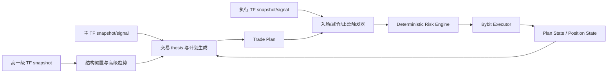
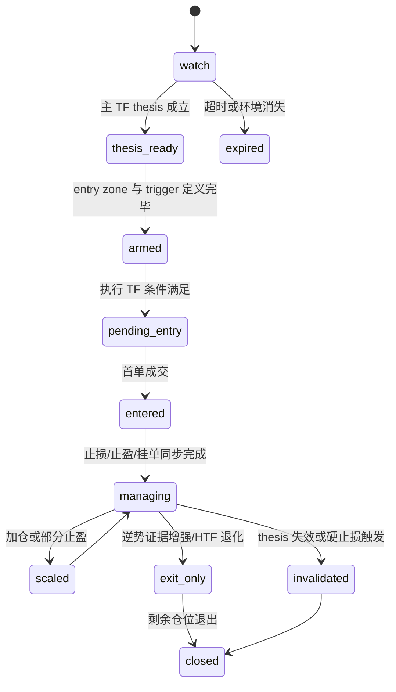

# Trading Agent 决策生成与风控工程设计报告

> 本文是 agent 设计基线；最终实现契约以 `../freeze/mvp-phase-0-freeze.md` 为准。

## Executive summary

你的 Trading Agent 不应该被设计成“看到 signal 就下单”的信号执行器，而应该被设计成一个**基于多时间框架市场上下文先形成交易计划，再把 signal 当作计划触发与修正证据的计划型代理**。这类设计与 TradingView 的 webhook 现实约束是匹配的：TradingView 的 webhook 本质上是把 alert message 作为 HTTP POST 请求体发送给你的服务；如果消息是合法 JSON，就会以 `application/json` 发送；同时 TradingView 也明确提醒 open bar 上的 alert 可能与 bar close 后确认状态不一致，推荐使用 “Once Per Bar Close”，并提醒 `request.security()` 的多时间框架请求若处理不当会带来历史/实时不一致问题。基于这些官方约束，更稳妥的工程做法是：**各时间框架分别发 closed-bar webhook，后端聚合成 multi-timeframe state，再由 agent 在服务器端做计划生成与维护**，而不是把所有逻辑压进单一 Pine alert。citeturn16view0turn16view3

在模型层，最合适的落地方式是 **Vercel AI Gateway + Structured Outputs**。Vercel 官方文档说明，AI Gateway 通过统一端点支持多 provider / 多 model 路由、budget、observability、fallback；AI SDK 则支持 `generateObject` 与 Zod schema 的类型安全结构化输出；OpenAI 官方 Structured Outputs 文档进一步强调，JSON Schema 约束能显著降低缺字段、错误枚举和格式漂移问题。对交易计划系统来说，这意味着 agent 不应输出自由文本，而应输出**严格 schema 化的计划对象或计划补丁对象**。同时，Structured Outputs 并不等于“不会犯语义错误”，所以 schema 本身必须允许 `skip`，prompt 与应用层也必须把“证据不足时不交易”写成正常路径，而不是异常分支。citeturn6search6turn18view3turn19view0

在执行与风控边界上，最佳实践依然是：**LLM 只负责计划与维护，仓位、止损、最大亏损与下单许可必须交给 deterministic risk engine**。Bybit 官方文档已经提供了构建这条边界所需的关键信息：下单接口支持 TP/SL 与 `orderLinkId` 自定义幂等 ID；market order 在衍生品场景会被转换为 IOC limit order，若流动性不足或超过滑点阈值可能直接取消；精度与最小名义价值要从 instruments-info 的 `tickSize`、`qtyStep`、`minOrderQty`、`minNotionalValue` 等字段读取；API 和 WebSocket 也有明确限流规则。工程上，这意味着**开仓尽量用 limit / conditional，退出必须有硬 stop，仓位必须基于 stop distance 和账户风险预算计算，真实下单前必须经过 instrument 约束与账本对账**。citeturn12view0turn12view1turn12view2turn17search0

## 设计前提与职责边界

如果继续沿用你现在的 `bitpunk.webhook.v12` 设计，那么系统最重要的前提应该是：**`snapshot` 负责刷新市场状态，`signal` 负责提交交易候选；二者都不是订单指令**。这与 TradingView webhook 的官方语义是兼容的，因为 TradingView 本身并不定义业务层交易 payload，只负责把 alert message 推送出去；JSON 是你自己在 Pine 中构造的业务契约。TradingView 官方 Pine FAQ 也明确说明，alert message 可以通过静态 JSON、placeholders 或动态字符串拼接生成有效 JSON。citeturn16view0turn16view3

这也决定了系统职责必须清晰拆开。**Trading Agent** 的职责，是形成与维护计划；**Risk Engine** 的职责，是审批计划可否被转成订单；**Executor** 的职责，是把批准后的 intent 映射成交易所请求并持续对账。OpenAI 对 prompt injection 的官方说明强调，越是能够访问数据与执行操作的 agent，越要把模型的自主权限限制在可控边界内；因此让模型直接访问交易所 API 或直接根据自由文本调用交易工具，并不是稳妥设计。对你的系统来说，模型最安全的权限就是：读 canonical market state、读 plan state、输出结构化 plan object；除此之外都不要开放。citeturn11search0turn11search1turn19view0

另一个关键前提，是 webhook 入口天然是 **at-least-once** 而不是 exactly-once。TradingView 官方写得很清楚：如果接收方返回 500–599（不含 504），会每 5 秒重发一次，总计最多 3 次重发；配置层还要求只支持 80/443 端口，超过 3 秒未处理完成会取消请求。这意味着你的 agent 不应该由 webhook route 直接驱动，而应该由**已入库、已去重、已标准化**的内部事件驱动。换句话说，TradingView 只触发 `received`，真正的 `plan.generate` 与 `plan.update` 必须走异步 durable workflow。citeturn16view0turn16view1

基于以上约束，我建议把多时间框架职责定义成下面这样：

| 角色 | 典型时间框架 | 主要职责 |
|---|---|---|
| 高一级时间框架 | 4h / 1d / 1w | 判定高级趋势、大结构、方向 veto |
| 主交易时间框架 | 1h / 4h / 1d | 形成主计划、定义主要方向、结构位与 thesis |
| 执行时间框架 | 15m / 1h / 4h | 确认入场、减仓、止盈跟踪和局部失效 |

你给出的三组配置——`15m-1h-4h`、`1h-4h-1d`、`4h-1d-1w`——是合理的。真正重要的不是具体数字，而是**高一级只决定 bias，不直接触发；主时间框架决定计划，不直接微操；小一级才决定 entry/exit 的执行细节**。在工程上，这种分工还能降低 LLM churn，因为你不需要每个小周期信号都重写主计划。

## 多时间框架决策架构

整个 agent 的核心逻辑，应当从“signal 触发器”改成“**thesis → setup → trigger**”三级决策。也就是先判断你有没有要交易的市场结构，再判断有没有值得布置的 setup，最后才看 signal 是否满足执行条件。



这张图的重点在于：**signal 不是 thesis 的替代品，而是 trigger 的证据之一**。如果高一级和主时间框架给出的答案是“当前是强趋势延续阶段”，那么执行层面对逆势信号的默认解释就不应是“反手开仓”，而更应是“减仓、提保本、缩紧 trailing stop、进入 exit-only 模式”。反过来，如果主时间框架已经从趋势环境切换到结构衰竭或 transition，那么同样的 counter signal 才有资格被重新解释为 reversal candidate。这个设计与 Vercel AI Gateway 可跨 provider 统一 reasoning 细节、又能用结构化输出固定对象形状的能力是匹配的，因为你可以把“结构判断”“触发判断”“风险意图”拆成几个稳定字段，而不是让模型每次都写一段随意叙事。citeturn18view0turn6search6turn19view0

我建议主时间框架 planner 先输出四个独立评分，而不是一上来就输出 binary trade / no-trade：

| 评分 | 含义 | 主要依据 |
|---|---|---|
| `bias_confidence` | 高级别方向是否清晰 | HTF + 主 TF 一致性、regime、趋势结构 |
| `location_quality` | 当前价格位置是否值得动手 | 支撑/阻力、EMA 关键位、relative high/low、空间 |
| `signal_quality` | 当前 signal 是否有执行价值 | rank level、rank pct、gain、pain、alignment、divergence |
| `execution_readiness` | 执行条件是否已满足 | 是否到达 entry zone、exec TF 是否确认、波动与流动性是否允许 |

然后再由应用层把这些评分组合成计划状态。这样做的好处是：后续计划更新时，不必每次都重写整个交易 narrative，只需要重算哪一个维度发生了变化。OpenAI 的 evals 文档也强调，可靠 agent 的关键不是“相信一次输出”，而是围绕结构化目标持续评估行为是否符合预期。四维评分天然适合做 eval dataset。citeturn20search0turn20search1turn20search3

从策略语义上，我建议把市场环境进一步归纳为四类，并给每类限定默认动作：

| 环境 | 默认动作 | 顺势 signal 的角色 | 逆势 signal 的角色 | 风险上限建议 |
|---|---|---|---|---|
| 趋势确认 | 只做主方向 | 开仓 / 加仓 / 回踩再入 | 主要用于止盈、缩风险 | `1.0%–2.0%` |
| 震荡结构 | 只在边缘交易 | 边缘位置试仓或减仓 | 边缘反向交易可成立 | `0.5%–1.25%` |
| 过渡 / 压缩 | 观望或轻仓 | 仅做 breakout / reclaim | 仅做 probe | `0.5%–0.75%` |
| 趋势衰竭 | 先去风险，再决定反手 | 顺势 signal 只做剩余持仓管理 | counter signal 逐步获得建仓权 | `0.5%–1.0%`，反手前需额外确认 |

这个表最重要的地方在于，它把你提到的“趋势里很多反转信号是假信号”“震荡里不是每个多空信号都要做”写成了**显式默认行为**。只要把默认行为写进 developer prompt 和 risk rules，系统就不会每次都从零开始“重新思考交易哲学”。

## 交易计划生成设计

我建议把 agent 的输出拆成三个对象：`market_thesis`、`execution_playbook`、`risk_intent`。其中 `market_thesis` 回答“现在是什么市场”；`execution_playbook` 回答“何时、如何、在哪儿做动作”；`risk_intent` 回答“如果做，愿意承受多大风险”。真正批准后的仓位和下单参数不放在 agent 里，而放在 risk engine 里计算。

```json
{
  "action": "create | keep | patch | terminate | skip",
  "market_thesis": {
    "bias": "long | short | neutral",
    "environment": "trend | range | transition | exhaustion",
    "htf_bias": "bull | bear | neutral",
    "mtf_bias": "bull | bear | neutral",
    "bias_confidence": 0.0,
    "trend_end_score": 0.0,
    "structure_summary": "",
    "key_levels": [
      {
        "role": "support | resistance",
        "price_ref": "EMA50 | EMA100 | EMA200 | relative_high | relative_low",
        "importance": "primary | secondary"
      }
    ]
  },
  "execution_playbook": {
    "state": "watch | armed | pending_entry | entered | managing | exit_only | closed | invalidated | expired",
    "entry_style": "pullback | breakout_retest | range_edge | probe",
    "entry_zone": {
      "low": null,
      "high": null,
      "source": "structure | atr_band | exec_tf_setup"
    },
    "allowed_triggers": [
      "aligned_signal",
      "zone_touch",
      "break_retest",
      "counter_signal_for_trim"
    ],
    "requires_signal": true,
    "disqualifiers": [],
    "tp_style": "ladder | dynamic_trail | range_mean_revert",
    "update_policy": "minor_patch | major_patch | replace_only"
  },
  "risk_intent": {
    "risk_tier": "probe | starter | standard | high_conviction",
    "suggested_max_account_risk_pct": 0.0,
    "stop_anchor": "swing_low | swing_high | key_level_break | range_edge_break",
    "stop_buffer_atr": 0.0,
    "rationale_codes": []
  },
  "reasoning_summary": "",
  "evidence": []
}
```

这个 schema 之所以合适，是因为它天然适配 **Vercel AI Gateway + AI SDK `generateObject`** 的工作方式。Vercel 官方文档说明，AI SDK 能直接用 Zod schema 生成 type-safe structured outputs；Gateway 还能继续用同样的接口把请求路由到不同的 provider。另一边，OpenAI 官方则明确推荐尽量使用 Structured Outputs 而不是 просто JSON mode，因为前者能保证 schema adherence，而后者只保证“是合法 JSON”。对交易计划这种强约束对象来说，前者明显更合适。citeturn18view3turn6search6turn19view0

计划生成 prompt 的关键，不在于文采，而在于**把交易哲学与错误边界写死**。一个可执行的最小 prompt 组合应当包含下面三层。

System prompt 应明确：你是 plan generator，不是 execution agent；你只能基于输入的 canonical context、账户状态、已有计划与风险限制作答；你不得虚构价格、不得引入外部新闻、不得绕开 schema；如果证据不足，必须返回 `skip`，并让 execution playbook 保持 `watch`。OpenAI 官方 Structured Outputs 文档专门提醒，面对不兼容输入时，如果 prompt 不说明“如何空结果”，模型可能为了满足 schema 而幻觉式地填值，所以这条规则必须写在 system/developer 层，不应交给业务层事后猜测。citeturn19view0

Developer prompt 应写入你的核心交易逻辑。最重要的四条是：第一，HTF 只决定 bias，不直接触发；第二，在强趋势下，counter signal 默认视作风控信号而不是反手建仓信号，除非 `trend_end_score` 已经跨过阈值；第三，在 range 环境中，非边缘位置的 signal 默认忽略；第四，缺乏结构位置但存在潜在反转时，只能输出 `probe` 风险层级。这些规则和你的交易思想是一致的，而且比“请你当个优秀交易员”可执行得多。

Task prompt 则只负责把当前 triplet context、active plan、open risk 和这次事件交给模型，并要求输出上述 schema。由于 Vercel Gateway 还支持 reasoning 跨 provider 归一化，你可以额外要求模型给出 `reasoning_summary`，而不是直接保存全量 reasoning details。Gateway 官方文档说明，它会把不同 provider 的 reasoning detail 归一为统一结构，既可以保留 summary，也可以保留加密或 redacted 内容；从产品实践看，保留 summary 足够审计，原始 reasoning_details 则更适合 internal trace，而不是用户界面直出。citeturn18view0turn7search10

关于 signal 在计划中的地位，我建议明确改成“**证据加权器**”。也就是说：

- `signal.rank_level`、`rank_pct`、`gain`、`pain`、`regime_alignment`、`kl`、`divergence` 共同决定 `signal_quality`。
- `signal_quality` 影响的是“当前计划是否由 watch 进入 armed / pending_entry / trim / exit_only”，而不是直接决定“要不要生成一份计划”。
- 没有好 signal，但主时间框架 thesis 清晰时，计划依然可以存在，只是状态可能是 `watch` 或 `armed`。
- 有好 signal，但 thesis 不成立时，计划应直接输出 `skip` 或 `watch`。

这样一来，你当前 payload 中的 `signal context` 就真正成为“重要但不至于独裁”的维度，符合你想要的 trade-off。

## 计划维护与终止机制

交易计划不是一次性文本，而是一个会随市场推进不断“补丁更新”的对象。我建议把 plan lifecycle 明确做成状态机，而不是靠自由文本理解。



这个生命周期最大的好处，是把“计划生成”和“计划更新”分成了不同动作。生成只发生在 `watch → thesis_ready` 或 `thesis_ready → armed` 阶段；后续大部分时候只是 `patch`。工程上，这能显著降低模型调用成本，也更适合用 AI Gateway 的 usage / spend / request observability 来监控不同 event type 的真实成本。Gateway 官方文档显示，它会记录按模型、按项目、按 API key 维度的请求量、TTFT、token 和 spend，非常适合把 `plan.generate` 与 `plan.update` 分开统计。citeturn18view1turn6search6

我建议更新触发器只保留“实质性变化”，不要主 TF 每根 bar 都让模型重写计划。可触发 `plan.update` 的事件，应限定为：

| 事件 | 是否调用 agent | 说明 |
|---|---|---|
| 主 TF `signal` | 是 | 新 thesis、方向升级、重要逆势证据 |
| 主 TF `snapshot` regime 改变 | 是 | 计划需要 patch 或 terminate |
| 执行 TF `signal` 命中已 armed 计划 | 是 | 可能进入 pending_entry / trim / exit_only |
| 价格进入 entry zone | 可选 | 若 `requires_signal=false` 可直接执行，否则只备战 |
| 订单成交 / 部分成交 | 是 | 需要把计划推进到 entered/managing |
| TP hit / stop move | 是 | 计划进入新的风险阶段 |
| 普通无变化 `snapshot` | 否 | 只更新状态表，不跑 LLM |

在工作流上，这类“等待批准”或“等待后续条件”的逻辑非常适合 Inngest。Inngest 文档明确支持事件驱动 durable execution，以及 `step.waitForEvent()` 这类 human-in-the-loop / approval / timeout 流程；因此 plan 可以在 `armed` 状态等待执行 TF trigger，也可以在 `risk.approved` 后等待 `plan.approved.by_user`，超时则自动 `expired`。citeturn9search1turn1search2turn1search6

计划终止条件也应该显式化，而不是留给模型随缘表达。我建议至少有五类终止原因：

- **结构失效**：主时间框架关键结构被破坏，或 stop anchor 被穿透。
- **方向撤销**：HTF 与主 TF 的 bias 发生反转，原 thesis 不再成立。
- **时间过期**：入场窗口在若干 exec bars 或 1–2 根主 TF bars 内未触发。
- **完成退出**：计划目标完成，仓位为零。
- **风险强制终止**：全局 kill switch、日损上限、cluster risk 超标、venue forced reduce-only。

这里可以再加一个很有效但常被忽略的策略：**计划重试次数限制**。例如同一结构位两次试探都止损后，第三次不再自动发起；或者必须等待新的主 TF thesis 才允许重启。这能显著降低区间震荡时的反复亏损。

## 确定性风控与仓位引擎

风控层的核心原则只有一句话：**agent 决定“值不值得做”，risk engine 决定“最多能做多大、是否允许做”。** 这条边界必须在代码上体现，而不能只存在于脑子里。

我建议 risk engine 的输入只有四类：`trade_plan`、`portfolio_state`、`venue_constraints`、`risk_policy`。它不看自然语言 prompt，不依赖模型推理，不对外部网页做任何调用。其输出是一个 `RiskVerdict`：

```json
{
  "verdict": "approve | approve_with_reduction | reject",
  "approved_risk_pct": 0.0,
  "approved_qty": 0.0,
  "approved_notional": 0.0,
  "approved_stop_price": 0.0,
  "require_human_approval": true,
  "checks": [],
  "rejection_codes": []
}
```

在你的风险思想里，单笔交易最大亏损是总资产的 `0.5%–2%`。我建议不要让 agent 直接输出一个“浮动百分比”，而让它只输出 `risk_tier`，再由 deterministic mapping 计算目标风险。例如：

| 风险层级 | 单笔风险上限 |
|---|---|
| `probe` | `0.5%` |
| `starter` | `0.75%–1.0%` |
| `standard` | `1.0%–1.25%` |
| `high_conviction` | `1.5%–2.0%` |

是否允许进入更高层级，应至少满足：HTF / 主 TF 同向、结构位置明确、signal 与 regime 对齐、`pain` 在可接受范围、组合风险仍有余量。这样大小仓不再是模型一句“我很有信心”，而是**模型先表达层级，风控再套规则**。

对于 Bybit USDT 线性合约，最实用的单笔仓位公式可以写成：

```text
账户风险预算 = 账户权益 × 批准风险百分比

有效止损距离 = |入场价 - 硬止损价|
            + 预估手续费缓冲
            + 预估滑点缓冲

原始数量 = 账户风险预算 / 有效止损距离

数量取整后 = floor_to_qty_step(原始数量)
名义价值 = 数量取整后 × 入场价
```

如果以你举的例子计算，账户权益为 `1000`，这一笔批准风险为 `1%`，则风险预算为 `10`。若计划入场价为 `100`，硬止损为 `98`，不含成本时有效止损距离是 `2`，原始数量就是 `10 / 2 = 5`。若再加入手续费和滑点缓冲后有效距离变成 `2.1`，数量变成 `4.7619`，再按 `qtyStep` 向下取整。注意，这个推导只适合你在 MVP 阶段优先做 **Bybit `linear` 类别**；Bybit instruments-info 官方文档明确区分 `spot`、`linear`、`inverse`、`option`，而线性合约的 PnL 和 sizing 最直观，最适合作为第一版风控基准。citeturn12view1turn12view0

在应用这个公式前，必须先跑交易所级别约束检查。Bybit 官方 instruments-info 文档提供了价格和数量精度、最小单量、最小名义价值、最大市价/限价单量等约束；这些字段还可能双周调整，因此不能硬编码。风险引擎必须在 sizing 后，再经过 `tickSize`、`qtyStep`、`minOrderQty`、`minNotionalValue`、`maxMarketOrderQty` 或 `maxLimitOrderQty` 二次裁切。否则，即使你的数学仓位正确，提交到 Bybit 也会因为产品规则而失败。citeturn12view1

除了单笔风险，我强烈建议你多加三条组合级规则，因为这是 LLM 系统最容易忽略、但真人交易员非常看重的地方。

第一条是 **总 open risk 上限**。单笔可以是 0.5%–2%，但如果并行 5–10 笔都按上限开，组合风险会失控。MVP 更合理的默认值是：并行仓位不超过 5，组合 open risk 不超过 `4%–6%`；如果以后放宽到 10 笔，就必须同步压低平均单笔风险。

第二条是 **相关性 / cluster cap**。Crypto 里很多标的在风险事件上高度共振，BTC、ETH 与主流 alt 一起暴露时，10 笔不等于 10 个真正独立机会。工程上可以把标的分成几个 cluster，例如 `BTC beta`、`ETH beta`、`high-beta alts`，每个 cluster 设独立 open risk 上限。这样做比盯“笔数”更贴近真实风险。

第三条是 **add-on 只能用“已释放风险”**。如果一笔仓位已经部分止盈并把 stop 提到保本以上，那么“已释放风险”可以重新分配给加仓；如果仍处于满风险状态，则不允许再按新仓重新计算完整 1% 风险。这条规则能防止趋势里无限加仓把组合风险堆爆。

止损层面，我建议每个计划同时包含两个概念：**thesis invalidation anchor** 与 **exchange hard stop**。前者是策略逻辑位，比如 swing low / key EMA / range edge；后者是实际下到 Bybit 的止损价格，通常会在 invalidation anchor 外再加一层 ATR 或 tick buffer。这样你既不会把 stop 贴得过紧，又能保持“计划为什么失效”在策略上可解释。

止盈层面则可以动态，但要有默认模板。我的建议是：

- **趋势延续单**：小部分在 `1R` 或最近 swing 兑现，剩余仓位用结构跟踪或执行 TF 趋势跟踪。
- **震荡边缘单**：更重视中段和对边兑现，runner 比例要低。
- **过渡 / probe 单**：优先快进快出，尽快把风险回收到 0 或接近 0。

Bybit 的下单接口允许在下单时就带 TP/SL，后续也可以修改；但由于它的 market order 可能被转成 IOC limit order 且在流动性不足时取消，我建议**开仓默认优先 limit / conditional，只有强制平仓或灾难性保护才优先 market**。这条建议不是抽象偏好，而是直接来自 Bybit 官方的撮合说明。citeturn12view0

还需要特别注意几个 Bybit 的状态细节。官方 order stream 文档说明，取消与成交同时发生时，你可能会收到两条 `Filled`；execution stream 则可能在一条消息里带出同一订单的多个 executions；position stream 甚至会在 create/amend/cancel order 时即使仓位没变也推新消息。对你的系统来说，这意味着**agent 绝不能靠“收到一条 websocket 事件”就认定计划阶段变化，必须基于已归一化的 order / fill / position 账本推进状态**。此外，position stream 还会在某些风险限制调整下把仓位标成 `isReduceOnly=true`，一旦出现这个标记，系统应立刻禁止加仓，把该计划切到 `exit_only`。citeturn12view3turn12view4turn13search0

## 工程实现与评测

在工程落地上，我建议你把 agent 与 risk 系统拆成五个明确模块，但仍然放在同一个应用仓里：

| 模块 | 主要职责 |
|---|---|
| `market-state-assembler` | 聚合各 TF `snapshot` / `signal`，形成 canonical multi-timeframe state |
| `plan-agent` | 生成或 patch `trade_plan` |
| `risk-engine` | 计算风险、仓位、批准与拒绝 |
| `execution-intent-builder` | 从批准后的 plan 生成 venue-specific intent |
| `plan-state-reducer` | 用 fills、orders、positions 推进生命周期 |

配套数据库在 MVP 阶段只保留最小闭环：`market_states_current`、`market_states_history`、`trade_plan_versions`、`plan_transitions`、`risk_verdicts`、`execution_intents`。`portfolio_open_risk` 与 `cluster_exposure` 先由持仓和风控快照派生，不单独建表；这样既能把“模型输出是什么”和“系统最终批准/执行了什么”分开，又不会过早引入分析型表。

前端如果要实时看到计划和风控变化，Supabase Realtime 可以直接派上用场。官方文档说明，Realtime 的 Postgres Changes 用起来更简单，但 Broadcast 在可扩展性和安全性上更推荐；因此 MVP 第一版用 Postgres Changes 足够，等 plan / order / fill 事件量上来后再迁往 Broadcast。另一方面，Supabase Auth 与 RLS 是天然适合多用户交易面板的组合；官方文档明确表示 Auth 与 RLS 是一体化方案，而 RLS 最好给策略、账户和用户外键列都建索引，否则大表性能会明显退化。citeturn1search11turn1search3turn10search0turn10search1turn10search3

模型调用层建议统一走 AI Gateway，MVP 只保留两条 policy：`plan.generate` 和 `plan.update`。前者使用强模型，后者使用更快更便宜的模型；dashboard 文案先由结构化计划直接渲染，暂不为摘要再增加一次模型调用。Gateway 官方文档说明，它支持 provider routing、fallback、reasoning 归一化、ZDR 和成本监控，所以这两条 policy 完全可以只在 Gateway 改模型，而不用改业务代码。尤其是 ZDR 这一点值得强调：Vercel 官方写明 Gateway 自身有 ZDR 政策，也支持对单请求启用 `zeroDataRetention: true` 并仅路由到 ZDR-compliant providers；但如果你走 BYOK，Gateway 无法替你验证上游 provider 是否具备 ZDR 合约。因此，如果你的 plan prompt 包含账户暴露、持仓和风险信息，最好优先使用由 Gateway 直接管理路由的模式，而不是 BYOK 混用。citeturn6search6turn18view0turn18view1turn18view2

安全方面，要把 prompt injection 当成真实问题，而不是纸面问题。OpenAI 官方把 prompt injection 明确描述为 agent 系统的前沿安全挑战，尤其是在模型能访问外部系统和执行动作时更危险。对你的系统，最有效的防线不是“再写一段 prompt 告诉模型别被骗”，而是下面这几条工程限制：  
一是 planner 不浏览网页，不读论坛，不拉实时外部新闻，只读 webhook 规范化对象和数据库白名单字段；二是把所有输入都 typed 化，禁止把任意字符串直接拼进系统提示；三是 exchange execution 永远不作为模型工具；四是业务层对所有结构化输出做语义校验，不满足则直接 reject 而不是让第二个模型“帮忙修复后直接下单”。citeturn11search0turn11search1turn19view0

最后，一定要对 agent 做离线评测。OpenAI 官方 evals 文档很明确：对 LLM 系统来说，evals 是理解升级模型、调 prompt、换 provider 后系统是否仍然可靠的关键手段。你的 eval dataset 最适合直接来自历史 payload 与历史 plan 版本，至少应覆盖这四类样本：趋势延续、震荡边缘、过渡假突破、趋势衰竭反转。每条样本不要只评“方向对不对”，而要评：`environment 分类是否合理`、`是否不该交易时能输出 watch/skip`、`risk tier 是否过激`、`stop anchor 是否合逻辑`、`是否错误地把 counter signal 当成反手建仓`。citeturn20search0turn20search1turn20search3

## 最终建议

如果把这份设计压缩成一句最重要的话，那就是：**先让 agent 成为一个计划制定与维护系统，再让 risk engine 决定是否执行；不要反过来把 signal 执行包装成“agent”。**

对你的项目，我最推荐的首发组合是：

- 先只做一套时间框架，例如 **`1h-4h-1d` 的波段模式**。这套频率对 webhook、人工复核、模型成本和 testnet 执行都更友好。
- 先只做 **Bybit `linear`**，不碰 inverse / option。
- 先只做 **主时间框架生成计划、执行时间框架触发 entry/trim/exit**，不要让小周期信号改写高级别 thesis。
- 先只做 **limit / conditional 开仓，market 只用于紧急退出**。
- 先只做 **probe / starter / standard / high_conviction 四档风险层级**，而不是让模型输出任意百分比。
- 先只做 **plan patch**，不要每根 bar 全量重写计划。

真正必须尽快实现的，不是更多模型技巧，而是下面这些“看起来不性感但决定系统能不能活”的能力：  
主从三时间框架聚合、主计划状态机、风险预算公式、组合 open risk 上限、cluster cap、`orderLinkId` 幂等、instrument cache、fill/order/position 对账、以及离线 eval。TradingView 的 once-per-bar-close 与 webhook 重发语义、AI Gateway 的结构化输出与多 provider 控制面、Bybit 的 order/instrument/rate-limit/private-stream 规则，已经把这条工程路线的边界画得很清楚了。citeturn16view0turn16view1turn6search6turn18view3turn12view0turn12view1turn12view2turn13search0

如果你愿意，我对这套设计的下一步最自然的延伸，不是再做抽象“多 agent”，而是直接把它落成三份可以开工的工件：**交易计划 JSON Schema、risk engine 规则表、以及 Next.js + Inngest + Supabase + Gateway + Bybit 的代码目录与接口契约**。
